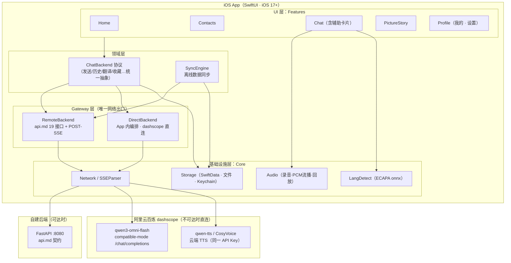
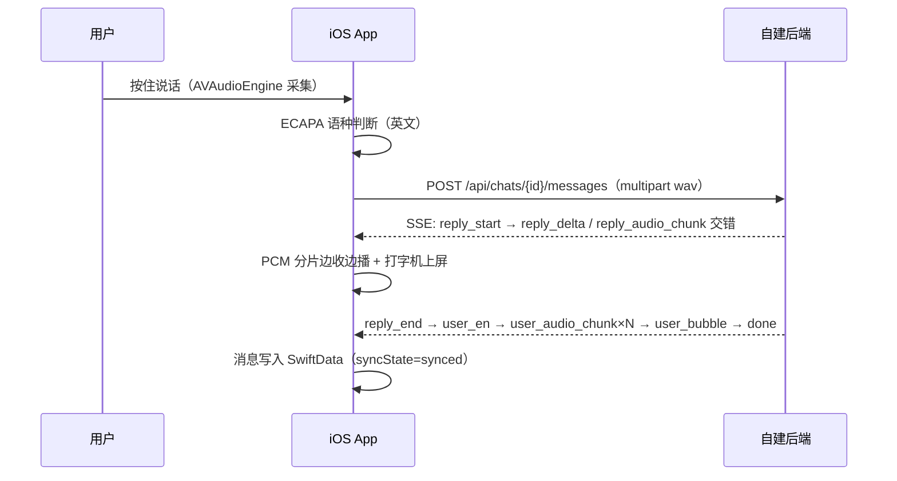
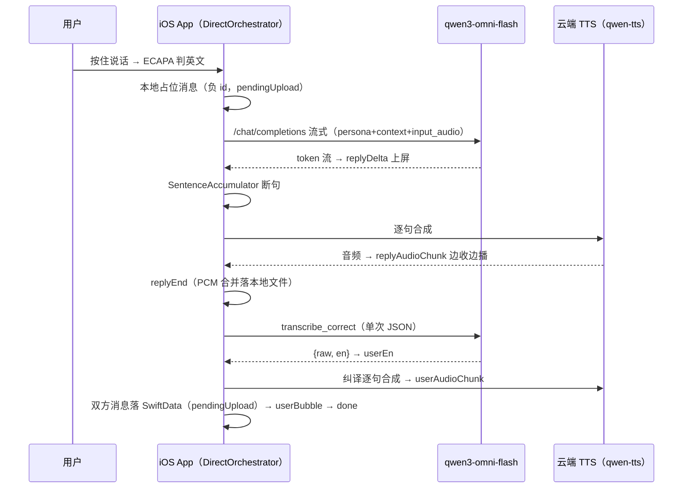
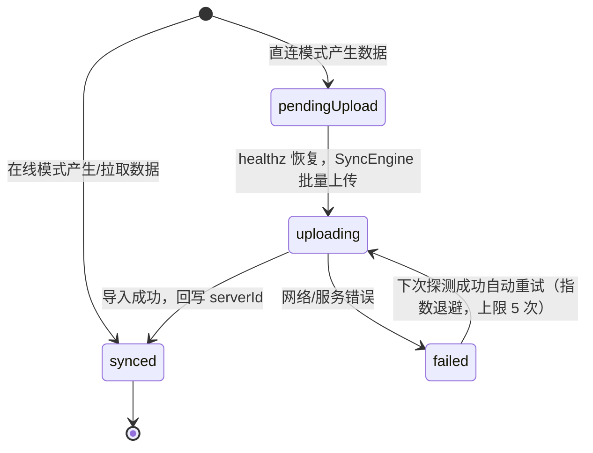

# iOS App 产品架构文档

> 本文档为 AI 口语陪练产品 **iOS 原生 App** 的产品架构与数据方案设计，与既有文档配套：
> [api.md](./api.md) 定义后端接口契约（19 个接口，App 在线模式完全复用），
> [architecture.md](./architecture.md) 定义后端内部实现；本文档定义 **App 端如何实现、存储与同步**。
>
> - 技术栈：**Swift 5.10+ / SwiftUI**，最低 **iOS 17**（SwiftData 要求）
> - 本地存储：**SwiftData**（本地优先，后端可达时同步）
> - 双通道：后端可达走自建 FastAPI（api.md 契约）；不可达时 App **直连 dashscope qwen3-omni-flash** 完成完整对话链路
> - TTS：**云端合成**（qwen-tts / CosyVoice，与多模态模型共用同一个阿里云 API Key），不在端侧跑 Kokoro
> - 模型配置（地址 / 模型名 / API Key）在 App「我的」页配置，Key 存 Keychain

## 目录

1. [总体架构](#一总体架构)
2. [技术选型](#二技术选型)
3. [双通道架构（核心）](#三双通道架构核心)
4. [本地数据模型与同步方案](#四本地数据模型与同步方案)
5. [「我的」页与设置](#五我的页与设置)
6. [云端 TTS 设计](#六云端-tts-设计)
7. [音频链路与 UI 规范](#七音频链路与-ui-规范)
8. [工程结构与里程碑](#八工程结构与里程碑)
9. [依赖后端的配套改动](#九依赖后端的配套改动)

---

## 一、总体架构

### 1.1 产品定位与功能范围

iOS App 全量承接 Web 端（`web/src/views`）已有功能，并补齐 Web 端尚为占位页的「我的」模块；用户端数据本地持久化，后端可达时自动同步，不可达时以 App 内置的云端模型配置独立完成对话链路（非只读降级）。

**功能清单与优先级**（与 `web/src/router/index.ts` 路由及 api.md 接口逐一对照）：

| 优先级 | 功能 | 对应 Web 页面 | 依赖接口（api.md 编号） |
|--------|------|--------------|------------------------|
| P0 | 聊天（文本 5a / 语音 5b SSE / 历史分页 / 清空 / 按需翻译） | ChatView | 4、5a、5b、18、19 |
| P0 | 辅助卡片（中文语音 → 翻译卡片 → 复读校验） | AssistCard（ChatView 内） | 16、17 |
| P0 | 联系人列表 | ContactsView | 3 |
| P0 | 收藏（气泡/卡片星标、收藏列表页） | favorites store + 占位页 | 9、10、11 |
| P1 | 首页（问候、学习统计、功能入口、继续练习） | HomeView | 1、2 |
| P1 | 看图讲故事（列表/分类/进度/评分/辅助提示） | PictureStoryView | 7、8、12、13、14、15 |
| P1 | 我的（资料、统计、设置：后端地址 / 模型配置 / TTS / 同步状态） | 占位页（App 端新实现） | 1、2 + 本地配置 |
| P2 | 英语秀场 / 故事跟读 / 对话跟读 / 听故事 | 占位页 | —（维持占位入口） |

> 接口 6（语音转写）在真实后端已被前端本地语种识别方案取代，App 同样不使用。

### 1.2 架构拓扑



### 1.3 分层约束

- **Features 之间不互相依赖**：页面共享的逻辑（录音、播放、语种识别、Toast、收藏状态）一律下沉到 `Core/` 或领域层，对应 Web 端 composables/stores 的职责边界；
- **Gateway 层是 App 唯一网络出口**：UI 层不直接发请求，全部经 `ChatBackend` 协议 → Remote/Direct 实现，与后端 `app/gateway/` Model Gateway 的切割思路一致——未来新增模型厂商或后端演进时只改 Gateway 层；
- **本地为唯一 UI 数据源**：页面只读 SwiftData 渲染；远端数据（历史消息、联系人、收藏）落地本地后驱动 UI 刷新（详见 §4.3）。

### 1.4 两种运行模式总述

| | 在线模式（后端可达） | 直连模式（后端不可达） |
|---|---|---|
| 对话/翻译/校验 | 自建后端（api.md 5a/5b/16/17/19） | App 内编排，直连 qwen3-omni-flash |
| TTS | 后端 Kokoro（随 SSE 分片下发） | 云端 qwen-tts / CosyVoice |
| 数据写入 | 服务端落库为准，本地镜像缓存 | 仅本地 SwiftData，标记待同步 |
| 判定方式 | `/healthz` 探测（2s 超时）+ NWPathMonitor | 同左，探测失败即切换 |

---

## 二、技术选型

| 组件 | 选型 | 理由 / 对应 Web 实现 |
|------|------|---------------------|
| UI 框架 | SwiftUI（iOS 17+） | 声明式，与 Vue3 组件树一一映射；iOS 17 起 SwiftData / Observation 可用 |
| 本地存储 | SwiftData | 镜像后端表结构（§4.1），替代 Web 端"无本地持久化"的现状 |
| 网络 | URLSession（async/await） | 原生；无需第三方依赖 |
| POST-SSE 解析 | `URLSession.bytes(for:)` 逐行解析 | 对应 `web/src/api/sse.ts` 的 fetch + ReadableStream 方案；EventSource 同样不支持 POST，必须手动解析 `event:` / `data:` 行 |
| 录音 | AVAudioEngine（installTap）→ 重采样 16kHz mono → WAV 编码 | 对应 `useRecorder.ts`：≤60s 上限提示、<0.5s"说话时间太短"、上滑取消 |
| 流式播放 | AVAudioEngine + AVAudioPlayerNode 按序 schedule Int16 PCM 24kHz 分片 | 对应 `usePcmPlayer.ts` 的 nextTime 排期"边收边播" |
| 整段回放 | AVAudioPlayer（rate 支持 0.7 慢速） | 对应 `playUrl` / `playBlob`；新播放打断上一个（全局单例语义） |
| 语种识别 | onnxruntime（SPM/CocoaPods `onnxruntime-objc`）加载 `ecapa_lang_id_int8.onnx` | 模型文件从 `web/public/models/` 复用打包进 App bundle；107 分类取 zh=106 / en=20 比较 logits，截取前 2s（32000 samples @16kHz），失败静默降级英文并提示一次（对齐 `useLangDetect.ts`） |
| 模型/TTS 调用 | URLSession 直连 OpenAI 兼容 `/chat/completions` 与 dashscope TTS | 对齐 `backend/app/gateway/mllm.py` dashscope 分支（§3.3） |
| 敏感配置 | Keychain（API Key） | Key 不入 UserDefaults / 不入日志 |
| 非敏感配置 | UserDefaults（后端地址、模型名、voice、语速、直连开关） | |
| 音频文件 | App `Documents/audio/` 目录 | 命名规则见 §4.2；对应后端 `storage/` 目录职责 |

**明确不引入**：端侧 TTS 模型（Kokoro，包体积代价大，已决策走云端）、第三方网络/存储框架、账号体系（单用户免登阶段延续，预留 JWT Header）。

---

## 三、双通道架构（核心）

### 3.1 ChatBackend 协议

领域层定义统一协议，UI 只面向协议编程；两个实现按可达性由 `BackendRouter` 自动选择：

```swift
protocol ChatBackend {
    // 聊天（对应 api.md 4 / 5a / 5b / 18 / 19）
    func fetchMessages(contactId: String, cursor: Int?, limit: Int) async throws -> MessagePage
    func sendText(contactId: String, text: String) async throws -> ChatReply
    func sendVoice(contactId: String, wav: Data) -> AsyncThrowingStream<ChatSSEEvent, Error>
    func clearMessages(contactId: String) async throws -> Int
    func translateMessage(id: Int64) async throws -> String
    // 辅助卡片（16 / 17）
    func assistTranslate(wav: Data) -> AsyncThrowingStream<AssistSSEEvent, Error>
    func assistVerify(wav: Data, en: String) async throws -> VerifyResult
    // 基础数据（1 / 2 / 3 / 9 / 10 / 11 / 12-15）
    func fetchContacts() async throws -> [Contact]
    // …favorites / picStory / user 同理
}
```

`ChatSSEEvent` 枚举与 api.md 5b 事件表一一对应：`replyStart(id)`、`replyDelta(text)`、`replyAudioChunk(seq, pcm)`、`replyEnd(duration, url)`、`userEn(en, raw)`、`userAudioChunk(seq, pcm)`、`userBubble(payload)`、`error(code, message)`、`done`。**两个实现产出同一套事件流**，ChatView 消费逻辑与通道无关。

### 3.2 RemoteBackend（后端可达）

- 严格按 api.md 契约调用现有 19 个接口，统一包裹 `{code, data, message}` 解析与错误码语义（400/404/409/413/429）与 Web 端 `http.ts` 一致；
- 5b / 16 为 POST-SSE：`URLSession.bytes(for:)` 逐行读取，按空行分帧、`event:`/`data:` 解析后映射为 `ChatSSEEvent`；
- 音频分片 `base64` 解码为 Int16 PCM 24kHz 直接喂播放器；终态事件中的 `/audio/*.wav` URL 拼接后端 Base URL 使用；
- 所有读到的数据（消息、联系人、收藏）写入 SwiftData 作为本地镜像（syncState=synced），供离线浏览与下次秒开。

### 3.3 DirectBackend（后端不可达，App 直连 qwen3-omni-flash）

App 内实现 `backend/app/gateway/mllm.py` 的等价物（`DirectMLLMClient`），直连 dashscope compatible-mode `/chat/completions`，**三处差异适配与后端 dashscope 分支完全一致**：

1. 音频 content part：`input_audio.data` 加 `data:;base64,` 前缀（wav 格式）；
2. payload 不带 `chat_template_kwargs`（本地 Gemma 专用），改传 `modalities: ["text"]`；
3. qwen3-omni-flash 仅支持流式：非流式语义的方法（transcribe / translate / verify / transcribe_correct）内部收流聚合，对上层透明。

**编排复刻**（`DirectOrchestrator`，对应 `backend/app/modules/chat/orchestrator.py` 两阶段）：

- 阶段A：`reply_stream`（persona + chat_reply system prompt + 最近 20 条本地上下文 + input_audio）流式产出 → 发 `replyDelta`；`SentenceAccumulator`（句末标点 + 空白切分、最小 8 字符防碎片，逻辑同 `backend/app/gateway/sentence.py`）断句喂云端 TTS → `replyAudioChunk` 与 delta 交错；结束合并 PCM 落本地文件 → `replyEnd`；
- 阶段B：`transcribe_correct` 单次 JSON 结构化调用 `{"raw":…, "en":…}`，正则取首个 `{...}` 解析，失败降级 raw=en=模型原文（对齐 `parse_transcribe_correct`）→ `userEn` → 逐句云端 TTS → `userAudioChunk` → 本地落库 → `userBubble` → `done`；
- 辅助卡片：接口 16 等价流程 transcribe(zh) → translate(zh_to_en) → 云端 TTS 分片（TTS 失败直接 error，不降级）；接口 17 等价流程 transcribe(en) → verify_semantic JSON 判定（解析失败按 consistent=false + 默认 reason）；
- 按需翻译（接口 19 等价）：本地消息无 zh 时调 `translate(en_to_zh)`，写回本地消息（幂等：已有 zh 直接返回）；
- TTS 失败降级与在线模式一致：对话链路保文本（`replyEnd` duration/url 为 nil），辅助卡片报错重试。

**提示词内置**：`backend/app/prompts.yaml` 的 7 个任务提示词（chat_reply / transcribe_en / transcribe_zh / transcribe_correct / translate_en_to_zh / translate_zh_to_en / verify_semantic）以资源文件形式打包进 App（`Prompts.yaml`），启动时加载并校验完整性；联系人 `persona_prompt` 后端接口 3 不外泄，直连模式使用**随 App 内置的默认联系人 seed**（含 persona，与 `backend/seeds/seed.py` 同源维护），在线期拉取的联系人仅更新展示字段、persona 以内置 seed 为准。

**上下文管理**：直连模式从本地 SwiftData 取该会话最近 20 条消息组装 context（`role: user|assistant, content: en`），与后端 `recent_context` 逻辑一致。

**单会话串行**：App 内 `SessionGuard`（Actor 实现，`Set<String>` 语义同后端）保证同一联系人同时只有一条 5b 流，重复触发本地提示"AI 正在回复中"（对齐 409 语义）。

### 3.4 可达性探测与通道切换

- 探测：`GET {backendBaseURL}/healthz`，超时 2s；结合 `NWPathMonitor` 网络状态（无网络直接判不可达，跳过探测）；
- 时机：App 进入前台、发送消息前、设置页手动"测试连接"；探测结果缓存 30s 避免每条消息都探测；
- 切换规则：可达 → RemoteBackend；不可达且已配置模型 API Key → DirectBackend；不可达且未配置 Key → 只读本地历史 + 引导去「我的」页配置；
- UI 提示：聊天页导航栏显示通道状态角标（在线 / 直连 / 离线只读），通道切换 toast 提示一次。

### 3.5 5b 语音消息时序（两种通道）

**在线模式**（与 Web 完全一致，后端编排见 architecture.md §2.3）：



**直连模式**（App 内编排，云端模型 + 云端 TTS）：



---

## 四、本地数据模型与同步方案

### 4.1 SwiftData 模型明细

镜像后端表结构（`backend/app/models/tables.py` + architecture.md §4.3 目标态），字段命名转 Swift 惯例；所有模型带 `createdAt` / `updatedAt`。

**LocalContact**（镜像 contacts，接口 3）

| 字段 | 类型 | 说明 |
|------|------|------|
| id | String（@Attribute(.unique)） | 如 `dad` |
| type | String | `human` / `ai` |
| name / tag / avatar / emoji / avatarBg / sub | String? | 展示字段，随接口 3 更新 |
| personaPrompt | String | 直连模式对话用；来源为 App 内置 seed（后端不外泄，见 §3.3） |
| sortOrder | Int | 列表排序 |

**LocalMessage**（镜像 messages，接口 4/5/19）

| 字段 | 类型 | 说明 |
|------|------|------|
| localId | Int64（@Attribute(.unique)） | 本地主键；离线产生取负数递减（对齐 Web 端临时气泡负 id 约定） |
| serverId | Int64? | 服务端消息 id（同步成功后回写；在线消息直接等于服务端 id） |
| contactId | String | 会话归属 |
| fromSide | String | `them` / `me` |
| en / zh / raw | String | 纠译 / 中文（按需生成）/ 原译 |
| duration | String? | `"m:ss"`；nil = 纯文本 |
| textOnly | Bool | 5a 产生的消息 |
| userAudioPath / ttsAudioPath | String? | 本地音频相对路径（§4.2）；在线消息缓存后端 URL 对应的下载文件，未缓存存远端 URL |
| syncState | String | `synced` / `pendingUpload` / `uploading` / `failed` |
| createdAt | Date | 排序与同步携带 |

索引：`#Index<LocalMessage>([\.contactId, \.localId])` —— 会话时间线分页唯一热点查询（对齐后端 `idx_timeline`）。

**LocalFavorite**（镜像 favorites，接口 9/10/11）

| 字段 | 类型 | 说明 |
|------|------|------|
| localId / serverId | Int64 / Int64? | 同 LocalMessage 约定 |
| en | String（会话内唯一去重键） | 英文原句 |
| zh | String | 可为空串（zh 未翻译时收藏，契约允许） |
| syncState | String | 同上；另有 `pendingDelete`（离线取消收藏一条已同步记录） |
| createdAt | Date | 列表倒序 |

**LocalPicStoryProgress**（镜像 pic_story_progress，接口 14/15）

| 字段 | 类型 | 说明 |
|------|------|------|
| seed | String（unique） | 故事种子 |
| bestScore | Int | 本地也执行 GREATEST 保最高分 |
| syncState | String | `synced` / `pendingUpload` |

**LocalUserStats / LocalUserProfile**（镜像接口 1/2）：todayMinutes / streakDays / lastActiveDate / name / level 等，直连期学习时长本地累计，恢复后上报为后续迭代项（首版只读展示）。

### 4.2 音频文件组织

- 目录：`Documents/audio/`，命名对齐后端 storage 约定：`msg_{localId}_raw.wav`（用户原声）、`msg_{localId}_tts.wav`（合成音）、`assist_{uuid}_tts.wav`（辅助卡片，7 天 TTL 清理任务）；
- localId 为负（离线消息）时同名落盘，同步回写 serverId 后**文件不重命名**（DB 路径字段为准，避免移动文件的失败面）；
- 在线模式播放远端 `/audio/*.wav` 时边播边缓存到同目录，供离线回放。

### 4.3 本地优先读写路径

- **读**：页面一律查 SwiftData 渲染（进聊天页先展示本地最近一页 → 后台调接口 4 增量对账刷新）；
- **写（在线）**：SSE 终态事件（reply_end / user_bubble）到达即写本地（syncState=synced，serverId=事件 id）；
- **写（直连）**：消息完成即写本地（负 localId、syncState=pendingUpload），UI 无差别渲染；
- 联系人 / 看图故事内容等运营数据：在线时拉取覆盖本地镜像，离线时用镜像（首启内置 seed 兜底）。

### 4.4 同步状态机



SyncEngine 触发时机：可达性探测由"不可达 → 可达"翻转时、App 进入前台且存在 pending 数据时、设置页手动"立即同步"。同步过程串行按会话分组执行，避免并发导致的顺序错乱。

### 4.5 同步范围与策略

| 数据 | 上行策略 | 下行策略 | 冲突原则 |
|------|---------|---------|---------|
| messages | 新增**批量导入接口**（见下）按 createdAt 升序上传，返回 id 映射回写 serverId | 接口 4 游标分页增量拉取，serverId 去重 | 服务端 id 为权威；本地 pending 只增不改服务端已有记录 |
| favorites | pendingUpload 重放接口 10（幂等：en 已存在返回已有行）；pendingDelete 重放接口 11 | 接口 9 全量拉取合并 | en 为业务唯一键，重放天然幂等 |
| pic_story_progress | 接口 15 PUT 重放（服务端 GREATEST 保最高分，幂等） | 接口 14 拉取合并（取双方较大值） | 分数取大，无冲突 |
| zh 按需翻译 | 离线期生成的 zh 随消息导入携带，不再重复调接口 19 | — | — |

**消息批量导入接口契约（需后端新增，App 上线前置项）**：

`POST /api/chats/{contactId}/messages/import`（multipart/form-data）

| 字段 | 类型 | 说明 |
|------|------|------|
| messages | JSON 数组（text 字段） | 每条：`{ clientId, from, en, zh, raw, duration, textOnly, createdAt }`；clientId 为本地负 id，用于映射回写 |
| audio_{clientId} | file（可选，多个） | 该条消息的用户原声 wav（TTS 音频不回传，后端允许缺失） |

响应 `data`：`{ "idMap": { "-3": 231, "-2": 232, … } }` —— App 按映射回写 serverId 并置 synced。语义：按 createdAt 落库保持时间线顺序；服务端以 `(user_id, contactId, clientId)` 幂等去重，重复导入返回已有映射。

---

## 五、「我的」页与设置

我的 Tab（Web 端为占位页，App 端实现）自上而下：用户资料卡（接口 1）、学习统计（接口 2）、我的收藏入口、设置区、同步状态区。

**设置区配置项**：

| 分组 | 配置项 | 存储 | 默认值 |
|------|--------|------|--------|
| 后端服务 | Base URL | UserDefaults | 预置开发环境地址（如 `http://<局域网IP>:8080`） |
| | 连接状态指示 | —（实时探测） | healthz 结果：在线 / 不可达 |
| 多模态模型 | 离线直连模式开关 | UserDefaults | 开（未配 Key 时自动降只读） |
| | Base URL | UserDefaults | dashscope compatible-mode 地址（同 `backend/.env.example` 注释示例） |
| | 模型名 | UserDefaults | `qwen3-omni-flash` |
| | API Key | **Keychain** | 空；输入后掩码显示（仅显示尾 4 位），不写日志 |
| | 测试连接按钮 | — | 调 `GET {baseURL}/models` 验证（对齐后端 `ping()`） |
| TTS | 音色 voice | UserDefaults | 云端默认音色（§6） |
| | 语速 | UserDefaults | 1.1（对齐后端 TTS_SPEED） |

**同步状态区**：待同步消息数（pendingUpload/failed 计数）、上次同步时间、手动「立即同步」按钮（触发 SyncEngine）、失败明细入口。

---

## 六、云端 TTS 设计

- 直连模式下 App 调 dashscope 语音合成（首选 `qwen-tts`，备选 CosyVoice 系列），**复用「我的」页配置的同一个 API Key**；请求走同一 dashscope 域名，无需第二份凭证；
- 输出统一转为 Int16 PCM mono 送入既有播放管线（AVAudioPlayerNode 分片排期），采样率以服务返回为准（qwen-tts 为 24kHz，与后端 Kokoro 一致，播放层无需变更）；若接口仅支持整段返回，则按 `SentenceAccumulator` 断出的句子粒度逐句请求，模拟分片交错体验；
- **合成前 emoji 过滤**：与后端 `strip_emoji` 同一正则（国旗/表情/图形符号/变体选择符/零宽连接符/键帽），过滤后为空的纯表情分片直接跳过不请求（三条 TTS 链路——AI 回复、我方纠译、辅助卡片——统一出口过滤）；
- 降级策略对齐现有产品：对话链路（5b 等价）TTS 失败保文本、`replyEnd` duration/url 为 nil、隐藏语音条；辅助卡片链路 TTS 失败直接 error 提示重试（语音条是卡片核心产物，不静默降级）；
- 已知取舍：云端音色与后端 Kokoro `af_heart` 不一致，同一会话在两种通道间切换时音色会变化——接受该差异，不做音色对齐。

---

## 七、音频链路与 UI 规范

### 7.1 音频链路全景

```
录音：AVAudioEngine tap（硬件采样率）→ 线性重采样 16kHz mono → Int16 WAV 编码（≤60s）
   → ECAPA 语种判断（前 2s 样本）
   → 英文：在线 = multipart 上传 5b ／ 直连 = base64 + data URI 前缀进 input_audio part
   → 中文：辅助卡片链路（16/17 或其直连等价）
下行：在线 = SSE base64 分片 → 解码 Int16 PCM 24kHz → AVAudioPlayerNode 按序排期边收边播
     直连 = 云端 TTS 逐句返回 → 同一播放管线
   → 完整 PCM 合并 → WAV 落 Documents/audio/（历史回放用）
回放：本地文件优先，缺失时远端 URL 边播边缓存；支持 0.7 慢速
```

**采样率与格式约定表**：

| 环节 | 格式 | 说明 |
|------|------|------|
| 上行录音 | WAV, 16kHz, mono, Int16 | 后端白名单含 wav；直连时 base64 后送模型（模型标准输入，免转码） |
| 语种判断输入 | Float32, 16kHz, ≤32000 samples | 与录音同源，截前 2s |
| 下行分片 | Int16 PCM, 24kHz, mono, 裸流 | 无容器头；base64 内联（在线）或云端 TTS 转换产物（直连） |
| 本地落盘 | WAV, 24kHz（TTS）/ 16kHz（原声） | 与后端 storage 产物一致 |

音频会话（AVAudioSession）：录音用 `.playAndRecord` + `.defaultToSpeaker`，播放用 `.playback`；按住说话期间停止当前播放（对齐 Web 端 `player.stop()` 行为）。

### 7.2 UI / 交互规范承接

既有交互规范在 App 端等价落点（引用现有规范，不重新发明）：

| 既有规范 | App 端落点 |
|---------|-----------|
| 按住说话：上移 60pt 进入取消态，松开取消/发送 | DragGesture 跟踪 translation.height，交互语义与 `useTalk.ts` 一致 |
| 「纠译」用户可见文案统一为「AI译」 | 气泡展开区标签：原译 / AI译；代码与文档内部仍称 raw / en |
| 辅助卡片：跟读时增加底部内边距避免 TalkHint 遮挡；「读完啦」比对中置灰显示"口音比对中…"；比对失败原因就地显示在语音条位置（不用 toast） | AssistCardView 同规格实现 |
| 关键操作反馈就地展示，避免依赖易消失的 toast | 翻译中占位、同步失败标记等均气泡/行内就地呈现 |
| iOS 安全区：贴底元素 padding 叠加安全区 | SwiftUI 原生 safeAreaInset / ignoresSafeArea 精确控制；TabBar、输入条、底部弹层不被 Home Indicator 遮挡 |
| 409 会话冲突提示"AI 正在回复中，请稍候" | SessionGuard 占用（直连）与后端 409（在线）统一走该提示 |
| 发送失败回滚：移除 pending 气泡与半成品 AI 气泡、文本还原草稿 | ChatViewModel 同语义实现 |

---

## 八、工程结构与里程碑

### 8.1 Xcode 工程目录

```
EnglishLearnApp/
├── App/                      # 入口、TabBar、路由、全局环境
├── Features/
│   ├── Home/                 # 首页（问候·统计·入口·继续练习）
│   ├── Contacts/             # 联系人列表（本地关键字过滤）
│   ├── Chat/                 # 聊天页 + ChatBubble + AssistCard + PressTalk
│   ├── PictureStory/         # 看图讲故事
│   └── Profile/              # 我的 + 设置 + 同步状态
├── Domain/
│   ├── ChatBackend.swift     # 协议 + 事件模型（§3.1）
│   ├── BackendRouter.swift   # 可达性探测与通道选择（§3.4）
│   └── Sync/                 # SyncEngine + 状态机（§4.4）
├── Gateway/
│   ├── Remote/               # api.md 19 接口 + POST-SSE 解析
│   └── Direct/               # DirectMLLMClient + DirectOrchestrator + CloudTTSClient + SentenceAccumulator
├── Core/
│   ├── Network/              # URLSession 封装、统一包裹解码、SSEParser
│   ├── Audio/                # Recorder / PcmStreamPlayer / FilePlayer / WavCodec
│   ├── LangDetect/           # ECAPA onnx 推理
│   └── Storage/              # SwiftData 容器、Keychain、文件管理
└── Resources/                # Prompts.yaml、内置联系人 seed、ecapa_lang_id_int8.onnx
```

### 8.2 里程碑与验收标准

| 里程碑 | 范围 | 验收标准 |
|--------|------|---------|
| M1 骨架 + 联系人 + 文本聊天 | Tab 骨架、接口 3/4/5a/19、SwiftData 镜像 | 真机连自建后端：联系人列表、文本对话、点译出中文、历史分页正常 |
| M2 语音链路 | 录音/WAV、ECAPA、5b SSE、PCM 流播 | 英文语音消息全链路：AI 回复边收边播、我方气泡回填原译/AI译；ECAPA 在 onnxruntime-objc 下推理正确（**本里程碑验证选型假设**） |
| M3 辅助卡片 + 收藏 + 清空 | 接口 16/17/18、9/10/11 | 中文语音进卡片、复读校验通过后进 5b；收藏增删同步 |
| M4 直连通道 + 设置页 | DirectBackend、我的页配置、云端 TTS | 关闭后端：配置 Key 后完整对话链路可用（含 TTS），三处 dashscope 差异比照 `mllm.py` 验证 |
| M5 本地存储与同步 | SyncEngine、消息导入接口对接 | 离线产生 N 条消息 → 恢复后端 → 自动同步、id 回写、Web 端可见同一批消息 |
| M6 看图讲故事 + 首页统计 | 接口 1/2/7/8/12-15 | 与 Web 端功能对等（依赖后端补齐相应模块） |
| M7 打磨 | 安全区细节、错误态、性能、TestFlight | 全功能真机回归，TestFlight 分发 |

---

## 九、依赖后端的配套改动

以下为 App 上线的后端前置项，**不在 App 工程内实现**，单独排期：

1. **消息批量导入接口**（§4.5 契约）：`POST /api/chats/{contactId}/messages/import`，含 clientId 幂等去重与 id 映射返回；
2. **favorites 模块**：接口 9/10/11 真实实现（favorites 表 + en_hash 唯一键，architecture.md §4.3 已有目标态设计，现仅 Web mock 支撑）；
3. **user 模块**：接口 1/2（users / user_stats 表已有设计）；
4. **pic-story 模块**：接口 7/8/12/13/14/15（M6 前置）；
5. CORS 与网络：后端 `CORS_ORIGINS` 对 App 无影响（非浏览器），但需确认后端监听地址对局域网真机可达（当前 uvicorn 绑定与防火墙）。

---

## 附：与现有代码的一致性对照

| 本文档设计 | 现有实现依据 |
|-----------|-------------|
| SSE 事件表（§3.1） | api.md 接口 5b 事件表、`web/src/views/ChatView.vue` 消费分支 |
| dashscope 三处差异（§3.3） | `backend/app/gateway/mllm.py` `_audio_part` / `_payload` / `_complete` 的 provider 分支 |
| transcribe_correct JSON 解析降级 | `backend/app/gateway/mllm.py` `parse_transcribe_correct` |
| 断句规则（句末标点+空白、最小 8 字符） | `backend/app/gateway/sentence.py` `SentenceAccumulator` |
| emoji 过滤正则 | `backend/app/gateway/tts.py` `strip_emoji` |
| 录音参数（16kHz/60s/0.5s） | `web/src/composables/useRecorder.ts` |
| 流播排期（24kHz nextTime） | `web/src/composables/usePcmPlayer.ts` |
| ECAPA 推理（zh=106/en=20/2s 截断/降级英文） | `web/src/composables/useLangDetect.ts` |
| 任务提示词 7 键 | `backend/app/gateway/prompts.py` `REQUIRED_KEYS` |
| dashscope 默认配置 | `backend/.env.example` 注释示例（地址 / `qwen3-omni-flash`） |
