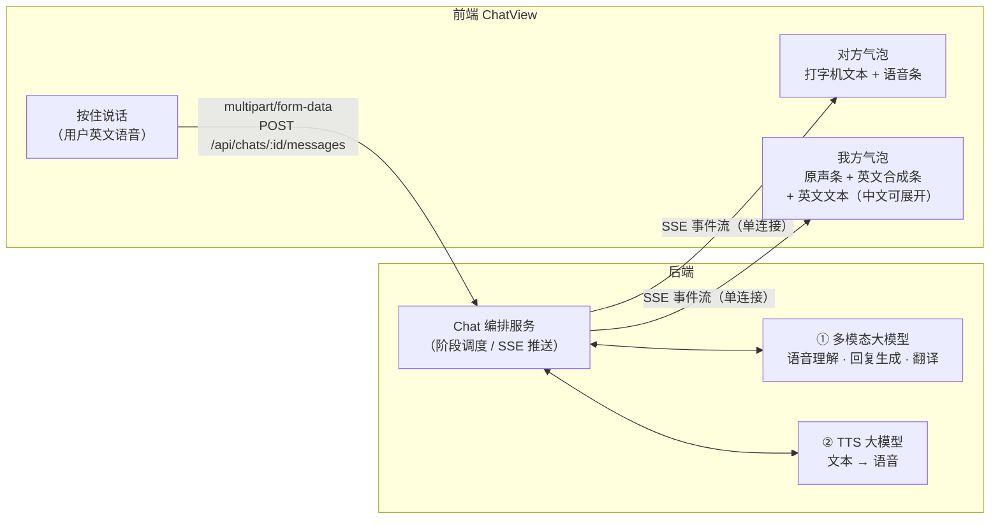
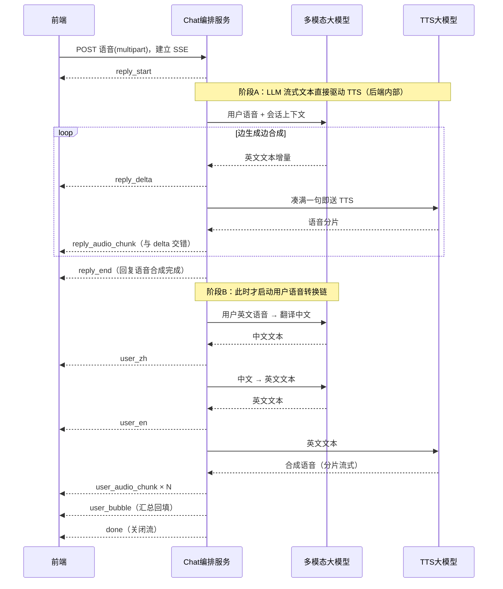
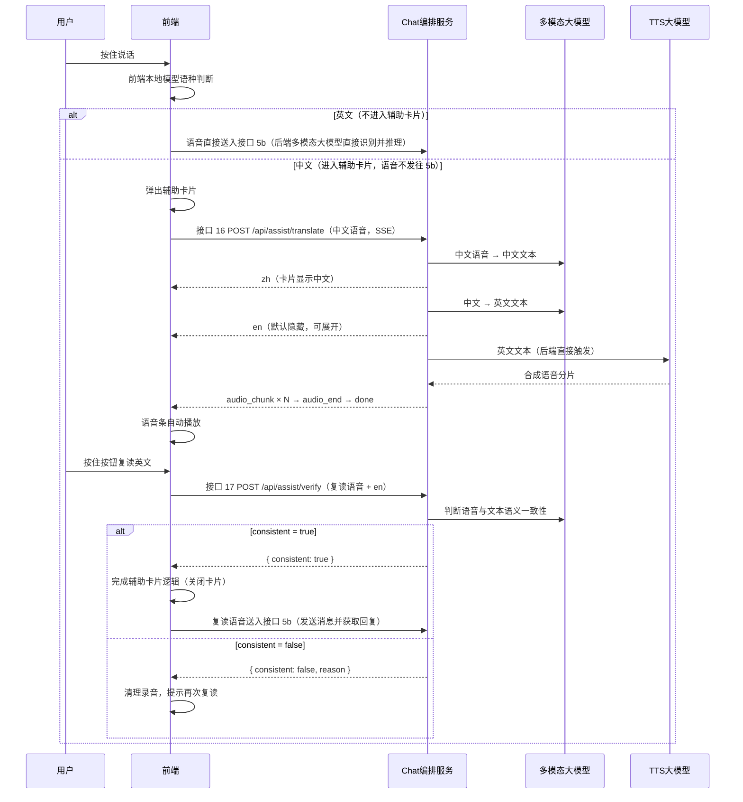

# 后端接口文档（API 契约）

> 本文档描述前端（`web/`）依赖的全部后端接口，共 **17 个**。
> 当前由 Vite dev 中间件模拟实现（`web/mock/plugin.ts` + `web/mock/data.ts`），真实后端按此契约实现即可无缝替换。
> 前端调用封装见 `web/src/api/index.ts`，类型定义见 `web/src/types/index.ts`。

## 目录

| # | 方法 | 路径 | 说明 | 使用页面 |
|---|------|------|------|----------|
| 1 | GET | `/api/user/profile` | 用户资料 | 首页 |
| 2 | GET | `/api/user/stats` | 学习统计 | 首页 |
| 3 | GET | `/api/contacts` | 联系人列表 | 对话列表 / 首页 |
| 4 | GET | `/api/chats/{contactId}/messages` | 聊天历史消息 | 聊天页 |
| 5 | POST | `/api/chats/{contactId}/messages` | 发送消息并获取回复（文本同步 / 语音 SSE 流式） | 聊天页 |
| 6 | POST | `/api/speech/transcribe` | 语音转写 | 聊天页 |
| 7 | POST | `/api/speech/score` | 语音评分 | 聊天页 / 看图讲故事 |
| 8 | GET | `/api/assist-hints` | 辅助卡片示例句 | 聊天页 / 看图讲故事 |
| 9 | GET | `/api/favorites` | 收藏列表 | 首页 / 收藏回显 |
| 10 | POST | `/api/favorites` | 添加收藏 | 气泡 / 辅助卡片星标 |
| 11 | DELETE | `/api/favorites/{id}` | 取消收藏 | 气泡 / 辅助卡片星标 |
| 12 | GET | `/api/pic-stories` | 看图故事列表 | 看图讲故事 |
| 13 | GET | `/api/categories` | 分类列表 | 看图讲故事（预留其他模块） |
| 14 | GET | `/api/pic-story-progress` | 讲述进度查询 | 看图讲故事 |
| 15 | PUT | `/api/pic-story-progress` | 讲述成绩保存 | 看图讲故事 |
| 16 | POST | `/api/assist/translate` | 辅助卡片翻译生成（SSE 流式） | 聊天页 / 看图讲故事 |
| 17 | POST | `/api/assist/verify` | 辅助卡片复读语义校验 | 聊天页 / 看图讲故事 |

## 通用约定

- **Base URL**：开发环境同源 `/api`（Vite dev server 直接拦截，无跨域）
- **请求体**：`Content-Type: application/json`（例外：接口 5 语音消息、接口 7、16、17 为 `multipart/form-data`，见下文）
- **统一响应包裹**（例外：接口 5 语音消息与接口 16 响应为 `text/event-stream`，不包裹）：

```json
{
  "code": 0,          // 0 = 成功；非 0 = 业务错误
  "data": {},         // 业务数据（各接口见下文）
  "message": "ok"     // 错误描述
}
```

- **错误响应**：HTTP 状态码与 `code` 同步，例如参数缺失返回 `400`：

```json
{ "code": 400, "data": null, "message": "en is required" }
```

- **错误码汇总**：

| 状态码 | 含义 | 触发场景 |
|--------|------|----------|
| 400 | 参数缺失/非法 | 必填字段为空、音频格式不在白名单（webm/ogg/mp4/wav）、时长超 60s |
| 401 | 未授权（预留） | 启用登录后 token 缺失/失效；当前单用户免登阶段不会出现 |
| 404 | 资源不存在 | `contactId` 不存在；未匹配的 `/api/*` 路径统一返回 `{ "code": 404, "data": null, "message": "not found" }` |
| 409 | 会话冲突 | 同一会话已有进行中的 5b 流（见接口 5b 错误与降级） |
| 413 | 请求体过大 | 上传音频超过 10MB |
| 429 | 触发限流 | 对话类接口（5b/16/17）单用户超过 20 次/分钟 |
| 500 | 服务端错误 | 未捕获异常 |

- **认证**：预留 `Authorization: Bearer <token>`（JWT）；当前阶段单用户免登、无需携带，后端对无 token 请求注入默认用户
- **SSE 接口的错误形态**（5b/16）：**流建立前**的错误（400/404/409/413/429）以普通 JSON 统一包裹返回；**流建立后**的错误以 `error` 事件下发（见各接口事件表）
- mock 实现附带 100–300ms 随机延迟以模拟网络；以下 **demo 的 `data` 字段均为真实 mock 返回值**

---

## 一、用户模块

### 1. 获取用户资料

`GET /api/user/profile`

无参数。

**响应 `data` 字段（UserProfile）**

| 字段 | 类型 | 说明 |
|------|------|------|
| id | string | 用户 ID |
| name | string | 昵称 |
| avatar | string | 头像 URL |
| level | number | 等级 |
| levelTitle | string | 等级称号 |
| totalHours | number | 累计学习小时数 |

**Demo**

```bash
curl http://localhost:5173/api/user/profile
```

```json
{
  "code": 0,
  "data": {
    "id": "amy",
    "name": "Amy",
    "avatar": "https://api.dicebear.com/7.x/avataaars/svg?seed=47",
    "level": 6,
    "levelTitle": "口语达人",
    "totalHours": 42
  },
  "message": "ok"
}
```

### 2. 获取学习统计

`GET /api/user/stats`

无参数。

**响应 `data` 字段（UserStats）**

| 字段 | 类型 | 说明 |
|------|------|------|
| todayMinutes | number | 今日学习分钟数 |
| streakDays | number | 连续打卡天数 |

**Demo**

```bash
curl http://localhost:5173/api/user/stats
```

```json
{ "code": 0, "data": { "todayMinutes": 24, "streakDays": 7 }, "message": "ok" }
```

---

## 二、联系人 / 聊天模块

### 3. 获取联系人列表

`GET /api/contacts`

无参数。

**响应 `data`：`Contact[]`**

| 字段 | 类型 | 说明 |
|------|------|------|
| id | string | 联系人 ID（聊天接口路径参数用） |
| type | `'human' \| 'ai'` | 真人 / AI 陪练 |
| name | string | 名称 |
| tag | string? | 角色标签（如"陪练者"，可空） |
| avatar | string? | 头像 URL（真人有） |
| emoji | string? | 头像 emoji（AI 有） |
| avatarBg | string? | emoji 头像底色（AI 有） |
| sub | string | 副标题（模式说明，可为空串） |

**Demo**

```bash
curl http://localhost:5173/api/contacts
```

```json
{
  "code": 0,
  "data": [
    { "id": "dad", "type": "human", "name": "爸爸", "tag": "陪练者", "avatar": "https://api.dicebear.com/7.x/avataaars/svg?seed=12", "sub": "我：练习者" },
    { "id": "mrJohnson", "type": "ai", "name": "Mr. Johnson", "emoji": "👨‍🏫", "avatarBg": "#e7f0fd", "sub": "老师 · 严谨纠错模式" }
  ],
  "message": "ok"
}
```

### 4. 获取聊天历史消息

`GET /api/chats/{contactId}/messages`

**路径参数**

| 参数 | 类型 | 说明 |
|------|------|------|
| contactId | string | 联系人 ID，不存在返回 404 |

**Query 参数（游标分页）**

| 参数 | 类型 | 必填 | 说明 |
|------|------|------|------|
| cursor | number | 否 | 上一页返回的 `nextCursor`，取比它更早的消息；缺省表示取最新一页 |
| limit | number | 否 | 每页条数，默认 20，最大 50 |

**响应 `data`**

| 字段 | 类型 | 说明 |
|------|------|------|
| list | `ChatMessage[]` | 页内按 `id` 升序（时间正序，前端可直接渲染/前插） |
| hasMore | boolean | 是否还有更早消息 |
| nextCursor | number \| null | 本页最旧消息 id，下一页请求的 `cursor`；`hasMore=false` 时为 null |

**`ChatMessage` 字段**

| 字段 | 类型 | 说明 |
|------|------|------|
| id | number | 消息 ID |
| from | `'them' \| 'me'` | 发送方 |
| en | string | 英文内容 |
| zh | string | 中文翻译 |
| duration | string? | 语音时长（如 `"0:04"`；无则为纯文本消息） |
| score | number? | 我方语音评分 |
| textOnly | boolean? | 纯文本消息（无语音条） |

**前端消费约定**：进入聊天页不带 `cursor` 拉最新一页；上滑到顶且 `hasMore=true` 时携带 `nextCursor` 拉更早一页，前插到消息列表头部。

> mock 行为：mock 消息量少（1 条对方问候语，AI 与真人话术不同），一页返回全部，`hasMore=false`。

**Demo**

```bash
curl "http://localhost:5173/api/chats/dad/messages?limit=20"
```

```json
{
  "code": 0,
  "data": {
    "list": [
      { "id": 1, "from": "them", "en": "How was your day at school today?", "zh": "你今天在学校过得怎么样？", "duration": "0:04" }
    ],
    "hasMore": false,
    "nextCursor": null
  },
  "message": "ok"
}
```

### 5. 发送消息并获取回复

`POST /api/chats/{contactId}/messages`

**路径参数**：同上（`contactId`）。

同一路径按请求 `Content-Type` 分流为两种模式：

| 模式 | 请求 Content-Type | 响应 Content-Type | 适用场景 |
|------|--------------------|--------------------|----------|
| 5a 文本同步 | `application/json` | `application/json`（统一包裹） | 键盘输入的文本消息 |
| 5b 语音流式 | `multipart/form-data`（字段 `audio`） | `text/event-stream`（SSE，不包裹） | 按住说话的英文语音消息 |

> **适用范围**：5b 仅覆盖**用户说英文**的语音消息。语种判断由**前端本地模型**完成：判定为中文时不发往本接口，转入辅助卡片流程（接口 16/17）；判定为英文时直接送入本接口，后端多模态大模型直接对语音识别并推理，无需前置 ASR。

#### 后端架构（双大模型）

后端由 Chat 编排服务调度两个大模型完成全部处理，前端只消费 SSE 事件：

- **① 多模态大模型**：接收语音/文本输入，负责回复生成（流式英文文本）、用户语音→中文翻译、中文→英文文本转换
- **② TTS 大模型**：文本→合成语音



#### 处理时序（串行两阶段）

- **阶段A（回复优先）**：编排服务将用户语音 + 会话上下文送入多模态 LLM，流式产出英文回复文本（`reply_delta`）；**回复合成语音在后端由该流式文本直接触发**（凑满一句即送 TTS，边生成边合成，非前端触发），因此语音分片（`reply_audio_chunk`）与文本增量**可交错下发**，最后以 `reply_end` 收尾。
- **阶段B（严格在阶段A 的回复语音合成完成后启动）**：多模态 LLM 将用户英文语音译为中文（`user_zh`）→ 中文转英文文本（`user_en`）→ TTS 合成英文语音分片流式下发（`user_audio_chunk`）→ `user_bubble` 汇总回填我方气泡。



#### 5a. 文本消息（同步，现有行为不变）

**请求体**（`application/json`）

| 字段 | 类型 | 必填 | 说明 |
|------|------|------|------|
| text | string | 是 | 文本消息内容 |

**响应 `data` 字段**

| 字段 | 类型 | 说明 |
|------|------|------|
| reply | ChatReply | 对方回复：`{ id, from: 'them', en, zh, textOnly: true }` |

> 字段说明：`id` 为对方消息主键（number，数据库自增，与接口 4 的 `ChatMessage.id` 同源）；文本消息的回复为**纯文本**（`textOnly: true`，不触发 TTS，无 `duration`/语音条），与 5b 语音链路区分。

> mock 行为：按联系人类型（ai/human）从脚本中依次取回复，每个会话独立推进进度，超出脚本后停留在最后一条；当前 mock 仍返回旧结构 `{from,en,zh,duration}`，`id`/`textOnly` 待 mock 层同步改造。

**Demo**

```bash
curl -X POST http://localhost:5173/api/chats/dad/messages \
  -H "Content-Type: application/json" \
  -d '{"text":"I played football today."}'
```

```json
{
  "code": 0,
  "data": {
    "reply": { "id": 102, "from": "them", "en": "That sounds fun! Who did you play with?", "zh": "听起来很有趣！你和谁一起玩的？", "textOnly": true }
  },
  "message": "ok"
}
```

#### 5b. 语音消息（SSE 流式）

**请求体**（`multipart/form-data`）

| 字段 | 类型 | 必填 | 说明 |
|------|------|------|------|
| audio | file | 是 | 用户英文语音二进制（建议 `audio/webm;codecs=opus` 或 16kHz mono wav；白名单 webm/ogg/mp4/wav，大小 ≤10MB，时长 ≤60s，超限分别返回 400/413） |

> 语音时长由后端解码音频自行获取，无需客户端上报（与接口 16 同一约定）；我方气泡展示的原声时长由 `user_bubble` 事件的 `userAudio.duration` 回传。

**响应**：`Content-Type: text/event-stream`，不使用统一包裹。每个事件为标准 SSE 格式：

```
event: <事件名>
data: <JSON 载荷>

```

> 注意：响应为 POST 建立的 SSE 流，浏览器原生 `EventSource` 不支持 POST，前端需用 `fetch` + `ReadableStream` 逐行解析。

**SSE 事件表（串行两阶段，按 `event` 字段分发）**

| 顺序 | 事件 | data 载荷 | 说明 |
|------|------|-----------|------|
| 1 | `reply_start` | `{ id }` | 阶段A 开始：对方气泡占位上屏（`id` 为对方消息主键，number，数据库自增，与接口 4 同源） |
| 2… | `reply_delta` | `{ text }` | 回复英文文本增量（多模态 LLM 流式输出，前端打字机追加） |
| 2… | `reply_audio_chunk` | `{ seq, base64 }` | 回复合成语音分片（base64 内联直发；后端由流式文本按句触发 TTS，**可与 `reply_delta` 交错**；`seq` 从 0 递增） |
| 3 | `reply_end` | `{ zh, duration, url }` | 阶段A 完成：附回复的中文翻译、语音总时长（如 `"0:04"`）与完整语音地址（预分配，文件异步落盘，供历史回放）；TTS 降级时 `duration`/`url` 为 `null` |
| 4 | `user_zh` | `{ zh }` | 阶段B：用户语音已译为中文 |
| 5 | `user_en` | `{ en }` | 阶段B：中文已转英文文本 |
| 6… | `user_audio_chunk` | `{ seq, base64 }` | 阶段B：英文合成语音分片（base64 内联直发，TTS 流式，`seq` 从 0 递增） |
| 7 | `user_bubble` | `{ id, en, zh, userAudio:{url,duration}, ttsAudio:{url,duration} }` | 阶段B 完成：汇总回填我方气泡（原声 + 英文合成音 + 双语文本；`id` 为我方消息主键，number） |
| 任意 | `error` | `{ code, message }` | 流内错误（发生后直接 `done` 结束） |
| 末 | `done` | `{}` | 流结束，服务端关闭连接 |

**时序约束**

1. 阶段A 内 `reply_delta` 与 `reply_audio_chunk` 可交错（后端按句触发 TTS），但各自按序发送；
2. 阶段B 严格在 `reply_end`（回复语音合成完成）之后启动，`user_zh → user_en → user_audio_chunk → user_bubble` 严格有序；
3. 无论成功或 `error`，流均以 `done` 结束。

**错误与降级**

- **流建立前**的错误不进入 SSE，以普通 JSON 统一包裹返回：`audio` 缺失/格式非法 `400`、`contactId` 不存在 `404`、同会话已有进行中的流 `409`（单会话同时只允许一条 5b 流，前端应禁发或提示稍候）、音频超 10MB `413`、触发限流 `429`（对话类接口单用户 20 次/分钟）；
- **流建立后**的错误以 `error` 事件下发，随后 `done` 结束；
- **TTS 降级**：合成失败时已下发的 `reply_delta` 文本保留，跳过剩余 `reply_audio_chunk`，`reply_end` 正常收尾且 `duration`/`url` 为 `null`，前端隐藏该气泡语音条（保文本优先于中断对话）。

**音频分片传输说明**：分片为 **base64 内联直发**——TTS 产出分片后不经对象存储，直接编码进事件体下发，将分片延迟降到最低；分片 `base64` 解码后为 **Int16 PCM mono 24kHz** 裸音频流（无容器头，接口 16 的 `audio_chunk` 同格式），前端按 `seq` 顺序拼流播放（`AudioContext` 按片排队）。完整音频文件由后端在流结束后合并落盘为 **wav**，终态事件中的 `url`（`reply_end.url` / `user_bubble.*.url`）为最终地址（形如 `/audio/msg_{id}_tts.wav`），供历史消息回放使用；当场回放优先使用已接收的分片。

**Demo**

```bash
curl -N -X POST http://localhost:5173/api/chats/dad/messages \
  -F "audio=@voice.webm;type=audio/webm"
```

逐行事件输出示例（`-N` 禁用缓冲，事件按到达顺序打印）：

```
event: reply_start
data: {"id":101}

event: reply_delta
data: {"text":"That sounds "}

event: reply_delta
data: {"text":"fun! "}

event: reply_audio_chunk
data: {"seq":0,"base64":"GkXfo0AgQoaBAUL3gQFC…（音频分片 base64，略）"}

event: reply_delta
data: {"text":"Who did you play with?"}

event: reply_audio_chunk
data: {"seq":1,"base64":"o0AgQoaBAUL3gQFCouEB…（略）"}

event: reply_end
data: {"zh":"听起来很有趣！你和谁一起玩的？","duration":"0:04","url":"/audio/msg_101.webm"}

event: user_zh
data: {"zh":"我今天踢了足球。"}

event: user_en
data: {"en":"I played football today."}

event: user_audio_chunk
data: {"seq":0,"base64":"GkXfo0AgQoaBAUL3gQFC…（略）"}

event: user_audio_chunk
data: {"seq":1,"base64":"o0AgQoaBAUL3gQFCouEB…（略）"}

event: user_bubble
data: {"id":100,"en":"I played football today.","zh":"我今天踢了足球。","userAudio":{"url":"/audio/msg_100_raw.webm","duration":"0:04"},"ttsAudio":{"url":"/audio/msg_100_tts.webm","duration":"0:03"}}

event: done
data: {}
```

**前端消费约定**：发送时我方气泡立即以“原声语音条 + 转换中”占位上屏；`reply_*` 驱动对方气泡流式上屏（阶段A 先完成），音频分片 base64 解码后按 `seq` 拼流播放；`user_*` 驱动我方气泡逐步回填双语文本与英文合成音（阶段B 后完成）；`error` 时清理占位气泡并提示。

> 实现状态：5b 为接口标准，面向真实后端实现；当前 mock 层（`web/mock/plugin.ts`）与前端尚未实现，待标准确认后另行安排。

---

## 三、语音模块

### 6. 语音转写

`POST /api/speech/transcribe`

**请求体**

| 字段 | 类型 | 必填 | 说明 |
|------|------|------|------|
| scene | string | 是 | 场景标识，如 `"chat"` |

**响应 `data` 字段（TranscribeResult）**

| 字段 | 类型 | 说明 |
|------|------|------|
| lang | `'zh' \| 'en'` | 识别语种；`zh` 表示用户说了中文（前端据此打开辅助卡片） |
| en | string? | 英文转写文本（`lang='en'` 时有） |
| zh | string? | 中文翻译（`lang='en'` 时有） |
| score | number? | 本句发音评分（`lang='en'` 时有） |

> mock 行为：全局计数，**奇数次**返回 `{lang:'zh'}`，**偶数次**轮流返回英文样例（与原型演示节奏一致）。真实后端应上传音频并做 ASR。

> 辅助卡片新链路（接口 16/17）中，语种判断改由**前端本地模型**完成（判为中文不再发往后端），后端侧由多模态大模型直接对语音识别推理；本接口不再承担语种预判，仅为当前 mock 演示阶段的过渡实现，真实后端无需提供该能力。

**Demo**

```bash
curl -X POST http://localhost:5173/api/speech/transcribe \
  -H "Content-Type: application/json" -d '{"scene":"chat"}'
```

```json
// 第 1 次（识别到中文）
{ "code": 0, "data": { "lang": "zh" }, "message": "ok" }
```

```json
// 第 2 次（英文样例）
{
  "code": 0,
  "data": { "lang": "en", "en": "I had a great day, thanks!", "zh": "我度过了美好的一天，谢谢！", "score": 91 },
  "message": "ok"
}
```

### 7. 语音评分

`POST /api/speech/score`

**请求体**（`multipart/form-data`）

| 字段 | 类型 | 必填 | 说明 |
|------|------|------|------|
| audio | file | 是 | 待评分语音二进制（建议 `audio/webm;codecs=opus`；上传约束同接口 5b） |
| type | `'assist' \| 'dialogue' \| 'story' \| 'picture'` | 是 | 评分场景（辅助跟读 / 对话跟读 / 故事跟读 / 看图讲故事），缺省按 `assist` 处理 |

> 真实后端由多模态大模型对语音实时评分（无落库）；当前 mock 以 JSON 只接收 `type`、忽略音频，multipart 形态待 mock 层同步改造。

**响应 `data` 字段（ScoreResult）**

| 字段 | 类型 | 说明 |
|------|------|------|
| score | number | 评分（0–100） |

> mock 行为：按类型在固定区间随机出分——assist: 70–99、dialogue: 84–95、story: 85–96、picture: 75–98。

> 辅助卡片新链路中，`assist` 场景的跟读判定由接口 17 语义校验取代，本接口该场景相应收缩；其余场景（dialogue / story / picture）不变。

**Demo**

```bash
curl -X POST http://localhost:5173/api/speech/score \
  -F "audio=@voice.webm;type=audio/webm" \
  -F "type=picture"
```

```json
{ "code": 0, "data": { "score": 82 }, "message": "ok" }
```

---

## 四、辅助卡片

### 8. 获取辅助示例句

`GET /api/assist-hints?scene={scene}`

**查询参数**

| 参数 | 类型 | 必填 | 说明 |
|------|------|------|------|
| scene | `'chat' \| 'picture'` | 否 | 场景，默认 `chat`；未知场景返回 404 |

**响应 `data` 字段（AssistHint）**

| 字段 | 类型 | 说明 |
|------|------|------|
| zh | string | 中文提示语（"你可以这样说"） |
| en | string | 英文跟读句 |

> 辅助卡片新链路中，chat 场景的卡片内容改由接口 16 基于用户真实中文语音生成，本接口该场景被 16/17 取代（示例句 mock 演示保留）；picture 场景暂沿用本接口。

**Demo**

```bash
curl "http://localhost:5173/api/assist-hints?scene=picture"
```

```json
{
  "code": 0,
  "data": { "zh": "这张图讲的是野餐的故事。", "en": "This picture is about a picnic story." },
  "message": "ok"
}
```

### 16. 辅助卡片翻译生成（SSE 流式）

`POST /api/assist/translate`

前端本地模型检测到用户说中文后弹出辅助卡片（中文语音不进入接口 5b），并携用户中文语音调用本接口。后端处理链（双大模型，同接口 5b 架构）：多模态大模型直接对中文语音识别得中文文本 → 中文文本翻译为英文文本 → **TTS 在后端由英文文本直接触发**合成语音，分片流式下发给前端卡片。

**请求体**（`multipart/form-data`）

| 字段 | 类型 | 必填 | 说明 |
|------|------|------|------|
| audio | file | 是 | 用户中文语音二进制（建议 `audio/webm;codecs=opus`） |

> 语音时长由后端解码音频自行获取，无需客户端上报；处理链不区分场景，暂不设 `scene` 参数（未来若需场景化译文，再扩展具体上下文参数）。上传约束（白名单 webm/ogg/mp4/wav、≤10MB、≤60s）、建流前错误形态（400/413/429，JSON 统一包裹）与限流同接口 5b。

**响应**：`Content-Type: text/event-stream`，不使用统一包裹；SSE 格式、POST-SSE 解析方式（fetch + ReadableStream）与音频分片传输说明同接口 5b。

**SSE 事件表（严格有序）**

| 顺序 | 事件 | data 载荷 | 说明 |
|------|------|-----------|------|
| 1 | `zh` | `{ zh }` | 中文语音已转中文文本（卡片即时显示中文） |
| 2 | `en` | `{ en }` | 已翻译英文文本（卡片默认隐藏，点击展开） |
| 3… | `audio_chunk` | `{ seq, base64 }` | 英文合成语音分片（base64 内联直发，`seq` 从 0 递增） |
| 4 | `audio_end` | `{ url, duration }` | 合成完成：完整语音地址（预分配，文件异步落盘）与时长（卡片语音条就绪并自动播放，当场播放用已接收分片） |
| 任意 | `error` | `{ code, message }` | 流内错误（发生后直接 `done` 结束） |
| 末 | `done` | `{}` | 流结束，服务端关闭连接 |

**卡片渲染约定**（与现有 UI 规范对齐）：`zh` 到达即显示中文文本；中文下方为合成英文语音条，`audio_end` 后自动播放；英文文本默认隐藏，经「点击查看英文文本」按钮展开/收起。

> TTS 合成失败：以 `error` 事件下发后 `done` 结束（语音条是本链路卡片的核心产物，不做静默降级，区别于 5b 阶段A 的保文本策略）；前端保留已显示的 `zh`/`en` 文本并提示重试。

**Demo**

```bash
curl -N -X POST http://localhost:5173/api/assist/translate \
  -F "audio=@voice_zh.webm;type=audio/webm"
```

逐行事件输出示例：

```
event: zh
data: {"zh":"我和同学一起玩了足球。"}

event: en
data: {"en":"I played football with my classmates."}

event: audio_chunk
data: {"seq":0,"base64":"GkXfo0AgQoaBAUL3gQFC…（略）"}

event: audio_chunk
data: {"seq":1,"base64":"o0AgQoaBAUL3gQFCouEB…（略）"}

event: audio_end
data: {"url":"/audio/assist_88.webm","duration":"0:03"}

event: done
data: {}
```

### 17. 辅助卡片复读语义校验

`POST /api/assist/verify`

用户根据卡片提示的英文或语音按住按钮复读后，前端将复读语音与目标英文文本提交本接口；后端送多模态大模型判断语音内容与文本语义是否一致。

**请求体**（`multipart/form-data`）

| 字段 | 类型 | 必填 | 说明 |
|------|------|------|------|
| audio | file | 是 | 用户复读语音二进制 |
| en | string | 是 | 目标英文文本（接口 16 返回的 `en`）；为空返回 400 |

> 上传约束（白名单/10MB/60s → 400/413）与限流（429，对话类接口单用户 20 次/分钟）同接口 5b/16。

**响应 `data` 字段**（JSON 统一包裹）

| 字段 | 类型 | 说明 |
|------|------|------|
| consistent | boolean | 语音与文本语义是否一致 |
| reason | string? | 不一致原因（供前端提示，`consistent=true` 时省略） |

**前端约定**：`consistent=true` → 完成辅助卡片逻辑（关卡片），并将该复读语音以 multipart 送入接口 5b `POST /api/chats/{contactId}/messages` 进入正常发送链路；`consistent=false` → 清理本次录音并提示用户再次复读。

**Demo**

```bash
curl -X POST http://localhost:5173/api/assist/verify \
  -F "audio=@repeat.webm;type=audio/webm" \
  -F "en=I played football with my classmates."
```

```json
// 语义一致
{ "code": 0, "data": { "consistent": true }, "message": "ok" }
```

```json
// 语义不一致
{
  "code": 0,
  "data": { "consistent": false, "reason": "复读内容与目标句语义不符，请再试一次" },
  "message": "ok"
}
```

#### 辅助卡片全流程时序



> 实现状态：接口 16/17 为接口标准，面向真实后端实现；当前 mock 层（`web/mock/plugin.ts`）与前端尚未实现，待标准确认后另行安排。

---

## 五、收藏模块

### 9. 获取收藏列表

`GET /api/favorites`

无参数。

**响应 `data`：`Favorite[]`**（按收藏时间倒序）

| 字段 | 类型 | 说明 |
|------|------|------|
| id | number | 收藏 ID（删除用） |
| en | string | 英文原句（唯一键，服务端按此去重） |
| zh | string | 中文翻译 |
| createdAt | number | 收藏时间戳（毫秒） |

**Demo**

```bash
curl http://localhost:5173/api/favorites
```

```json
{
  "code": 0,
  "data": [
    { "id": 1, "en": "It was great. I played football with my classmates.", "zh": "很好，我和同学一起玩了足球。", "createdAt": 1753600000000 }
  ],
  "message": "ok"
}
```

### 10. 添加收藏

`POST /api/favorites`

**请求体**

| 字段 | 类型 | 必填 | 说明 |
|------|------|------|------|
| en | string | 是 | 英文原句；为空返回 400 |
| zh | string | 否 | 中文翻译 |

**响应 `data`：`Favorite`**（新建的收藏行；若 `en` 已存在则幂等返回已有行）

**Demo**

```bash
curl -X POST http://localhost:5173/api/favorites \
  -H "Content-Type: application/json" \
  -d '{"en":"Thank you! I love you.","zh":"谢谢你！我爱你。"}'
```

```json
{
  "code": 0,
  "data": { "id": 2, "en": "Thank you! I love you.", "zh": "谢谢你！我爱你。", "createdAt": 1753600123456 },
  "message": "ok"
}
```

### 11. 取消收藏

`DELETE /api/favorites/{id}`

**路径参数**

| 参数 | 类型 | 说明 |
|------|------|------|
| id | number | 收藏 ID |

**响应 `data` 字段**

| 字段 | 类型 | 说明 |
|------|------|------|
| removed | boolean | 是否真正删除（ID 不存在时为 `false`，不报错） |

**Demo**

```bash
curl -X DELETE http://localhost:5173/api/favorites/2
```

```json
{ "code": 0, "data": { "removed": true }, "message": "ok" }
```

---

## 六、看图讲故事模块

### 12. 获取故事列表

`GET /api/pic-stories`

无参数。

**响应 `data`：`PicStory[]`**

| 字段 | 类型 | 说明 |
|------|------|------|
| title | string | 故事标题 |
| seed | string | 图片种子（前端拼接 `https://picsum.photos/seed/{seed}/…` 取图；也是进度表主键） |
| cat | string | 所属分类 |
| sentences | string[] | 参考句组（逐词转写演示取材） |

**Demo**

```bash
curl http://localhost:5173/api/pic-stories
```

```json
{
  "code": 0,
  "data": [
    {
      "title": "公园野餐",
      "seed": "picnic",
      "cat": "家庭生活",
      "sentences": [
        "A happy family is having a picnic in the sunny park.",
        "They are sharing sandwiches and fresh fruit.",
        "Everyone is laughing and having a great time."
      ]
    }
  ],
  "message": "ok"
}
```

### 13. 获取分类列表

`GET /api/categories?type={type}`

**查询参数**

| 参数 | 类型 | 必填 | 说明 |
|------|------|------|------|
| type | string | 是 | 模块标识：`picStory`（当前使用）；`storyRead` / `dialogueRead` / `listenStory` 已预留；未知类型返回空数组 |

**响应 `data`：`string[]`**（首项固定为"全部"）

**Demo**

```bash
curl "http://localhost:5173/api/categories?type=picStory"
```

```json
{ "code": 0, "data": ["全部", "动物自然", "家庭生活", "户外探索", "节日活动"], "message": "ok" }
```

### 14. 查询讲述进度

`GET /api/pic-story-progress`

无参数。

**响应 `data`：`PicStoryProgress`**——`{ [seed]: 最高分 }` 映射，前端据此渲染货架 ⭐ 徽标并把已完成的故事排后。

**Demo**

```bash
curl http://localhost:5173/api/pic-story-progress
```

```json
{ "code": 0, "data": { "picnic": 82 }, "message": "ok" }
```

### 15. 保存讲述成绩

`PUT /api/pic-story-progress`

**请求体**

| 字段 | 类型 | 必填 | 说明 |
|------|------|------|------|
| seed | string | 是 | 故事种子；为空返回 400 |
| score | number | 是 | 本次评分 |

**响应 `data`：`PicStoryProgress`**（更新后的完整进度表）

> 服务端只在**高于历史最高分**时更新该故事的记录。

**Demo**

```bash
curl -X PUT http://localhost:5173/api/pic-story-progress \
  -H "Content-Type: application/json" \
  -d '{"seed":"beach","score":90}'
```

```json
{ "code": 0, "data": { "picnic": 82, "beach": 90 }, "message": "ok" }
```

---

## 附：服务端状态说明（真实后端需落库）

mock 实现中有 4 处内存状态，dev 服务重启即重置；真实后端需按用户维度持久化：

| 状态 | mock 位置 | 说明 |
|------|-----------|------|
| 聊天回复进度 | `chatReplyIdx`（Map） | 每个会话的脚本回复游标 → 真实后端为对话上下文 |
| 转写奇偶计数 | `transcribeCount` | 仅为演示“中文→辅助”节奏 → 真实实现中语种判断由前端本地模型完成 |
| 收藏列表 | `favorites`（数组，id 自增） | → 收藏表（用户 ID + 英文句唯一约束） |
| 讲述进度 | `picStoryProgress`（对象） | → 成绩表（用户 ID + 故事 seed，保留最高分） |

未移植模块（故事跟读、对话跟读、听故事、英语秀场、我的）后续需要新增各自的接口，目前仅 `GET /api/categories` 为其预留了 `type` 参数。
