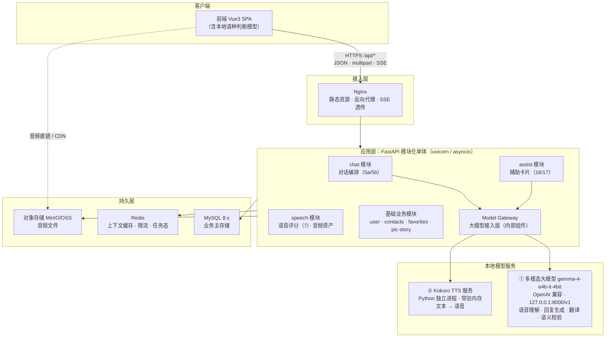
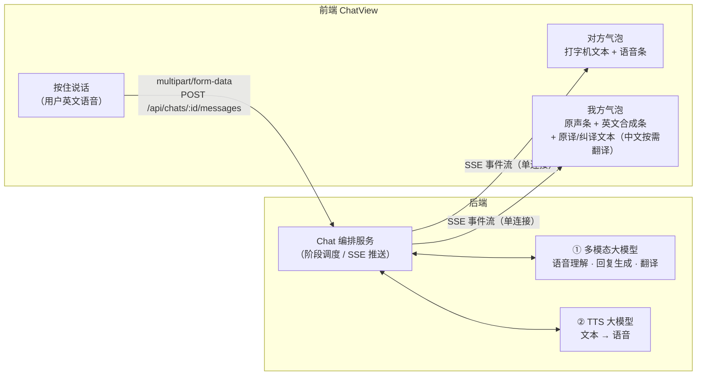
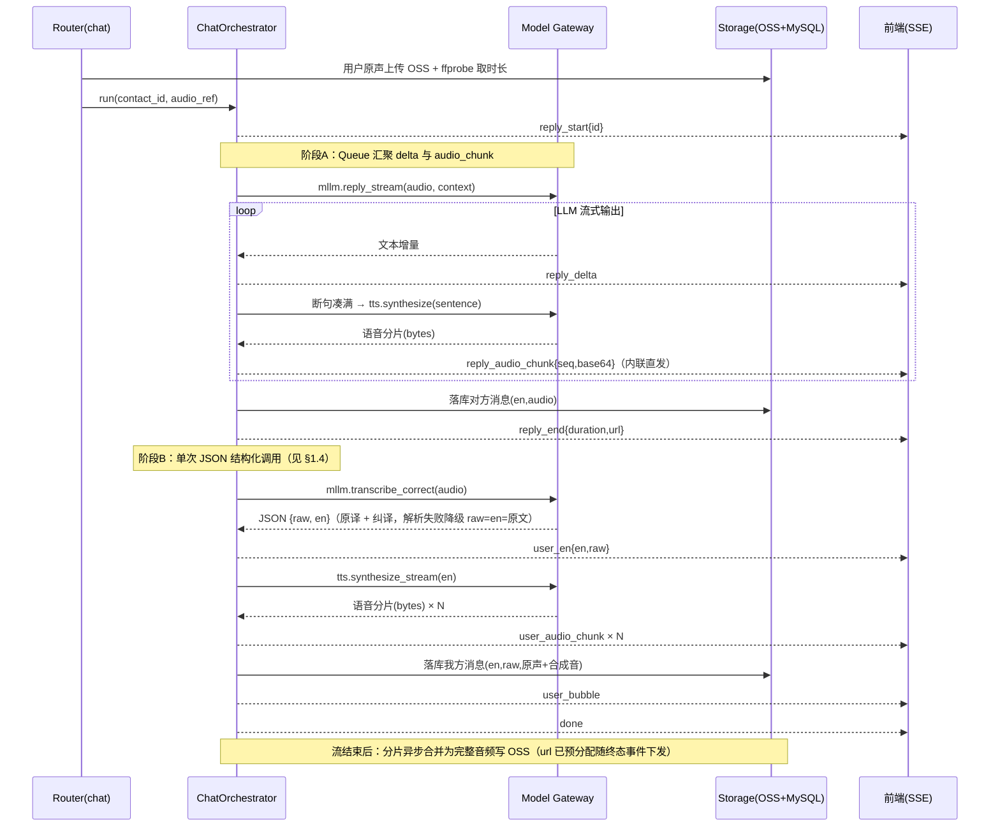
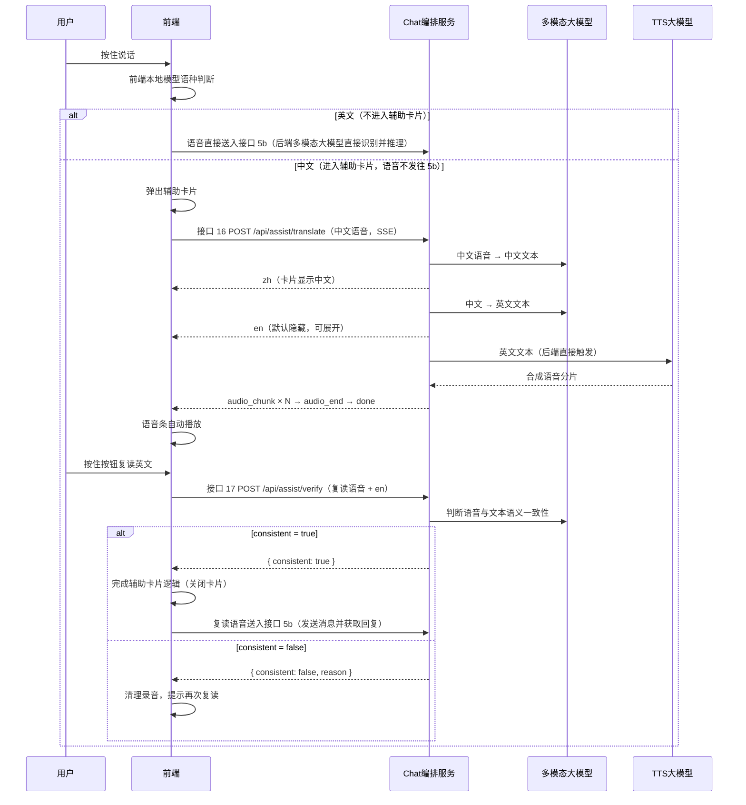
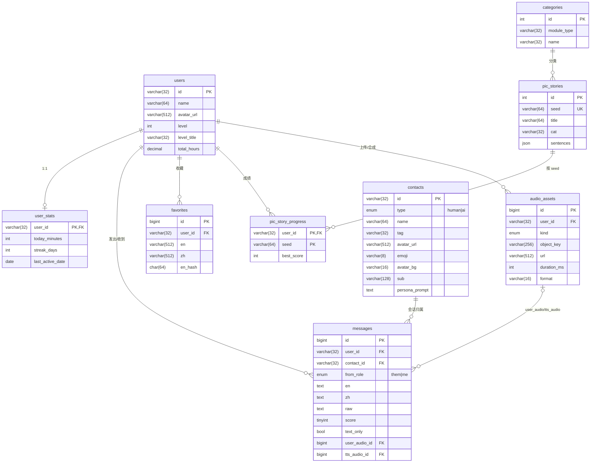
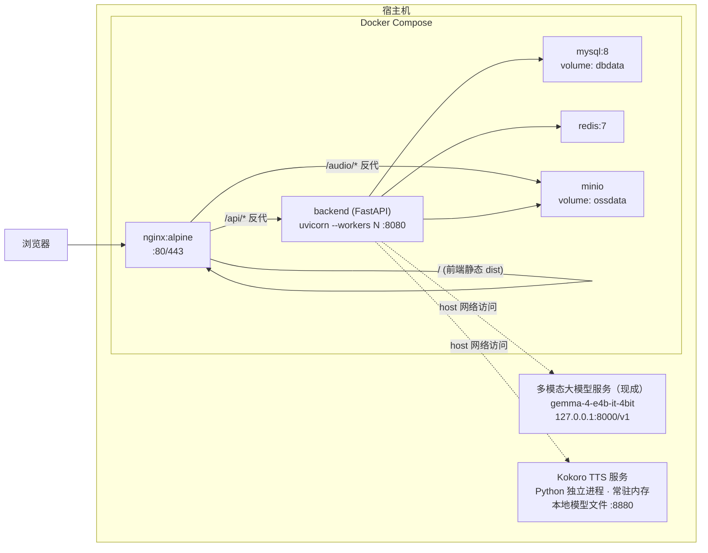

# 后端架构设计文档

> 本文档为 AI 口语陪练产品的后端架构与数据持久化设计，与接口契约文档 [api.md](./api.md)（19 个接口）配套：api.md 定义"对外承诺什么"，本文档定义"内部如何实现与存储"。
>
> - 技术栈：**Python 3.12 + FastAPI**（异步）
> - 数据库：**MySQL 8.x**
> - 架构形态：**模块化单体**（预留拆分边界）
> - 大模型（均为本地服务）：
>   - ① 多模态大模型：**现成本地服务**，OpenAI 兼容接口 `http://127.0.0.1:8000/v1`，模型 `gemma-4-e4b-it-4bit`，直接调用无需部署；音频输入为 **wav** 格式；提示词由产品侧配置（见 §2.5）
>   - ② TTS：**Kokoro** 本地模型（模型文件已在本地），需以 Python 启动**独立常驻服务**（模型加载后常驻内存）

## 目录

1. [总体架构](#一总体架构)
2. [对话架构（核心）](#二对话架构核心)
3. [基础架构](#三基础架构)
4. [数据持久化方案](#四数据持久化方案)
5. [部署架构](#五部署架构)
6. [接口-模块-表映射总表](#六接口-模块-表映射总表)

---

## 一、总体架构

### 1.1 架构拓扑



要点：

- **前端本地模型承担语种判断**（api.md 5b/16 约定）：中文语音不进 5b，直接走辅助卡片链路；后端**无独立语种预判、无前置 ASR**，语音由多模态大模型端到端识别推理。
- **Model Gateway 是模块内组件而非独立服务**：单体阶段以 Python 包边界隔离（`app/gateway/`），未来拆分时它与 chat/assist 编排一起独立为"对话服务"。
- **提示词不依赖模型服务内置，全部由产品侧配置**：角色人设在 DB `contacts.persona_prompt`（可运营配置），任务型提示词在后端配置文件 `prompts.yaml`（见 §2.5）。
- 音频文件不过 MySQL，只存对象存储；MySQL 仅存元数据（URL、时长、格式）。

### 1.2 技术选型

| 组件 | 选型 | 理由 |
|------|------|------|
| Web 框架 | FastAPI + uvicorn | asyncio 原生，`StreamingResponse` 一个 async 生成器即实现 SSE；Pydantic 契约校验与 api.md 表结构一一对应 |
| ORM / 迁移 | SQLAlchemy 2.0 async + Alembic | 异步会话贯穿全链路；迁移版本化 |
| MySQL 驱动 | asyncmy | 异步驱动中性能最好，SQLAlchemy 官方支持 |
| 数据库 | MySQL 8.x（utf8mb4） | 用户指定；JSON 类型承载句组等半结构化字段 |
| 缓存 | Redis 7 | 会话上下文缓存、SSE 并发锁、限流计数 |
| 对象存储 | MinIO（开发）/ 云 OSS（生产） | S3 兼容 API，开发生产无缝切换 |
| 多模态 LLM | gemma-4-e4b-it-4bit（OpenAI 兼容 API） | 现成本地服务 `http://127.0.0.1:8000/v1`，直接调用无需部署 |
| TTS | Kokoro（本地模型文件） | Python 独立常驻服务，模型加载一次后驻留内存（见 §2.5） |
| 音频处理 | ffmpeg（ffprobe） | 服务端解码取时长（api.md 约定客户端不上报 duration）、格式校验、上行音频 webm/ogg/mp4 → **wav 转码**（多模态模型输入要求 wav） |
| HTTP 客户端 | httpx（async） | 调用大模型 API，原生支持流式响应 |
| 日志 | structlog | 结构化 JSON 日志，串联 request_id / 模型调用耗时 |

### 1.3 模块划分

与 api.md 的功能模块一一对应，单体内按包隔离：

```
backend/
├── app/
│   ├── main.py                 # 应用装配、全局异常处理器、中间件
│   ├── core/                   # 配置(pydantic-settings)、日志、依赖注入
│   ├── gateway/                # Model Gateway：mllm.py / tts.py / prompts.py / sentence.py
│   ├── modules/
│   │   ├── chat/               # 接口 4、5a、5b：routers/service/orchestrator/repository
│   │   ├── assist/             # 接口 8、16、17
│   │   ├── speech/             # 接口 6（过渡）、7；音频资产上传/落盘
│   │   ├── user/               # 接口 1、2
│   │   ├── contacts/           # 接口 3
│   │   ├── favorites/          # 接口 9、10、11
│   │   └── picstory/           # 接口 12、13、14、15
│   └── models/                 # SQLAlchemy 模型（表定义集中，跨模块共享）
├── alembic/                    # 迁移脚本
└── tests/
```

模块间约束：**modules 之间不互相 import service**，共享逻辑下沉到 `gateway/`（模型调用）与 `speech`（音频资产），这是未来拆微服务的切割线。

### 1.4 第一阶段简化（当前实现状态）

第一阶段（`backend/`）已实现接口 **3、4、5a、5b、16、17** + `/healthz`，目标是打通对话核心链路；以下基础设施暂未引入，用更简的本地替代实现，接口契约不变：

| 目标架构 | 第一阶段替代 | 影响 |
|---------|-----------|------|
| Redis（会话锁/限流/上下文缓存） | 单 worker uvicorn + 进程内 `SessionGuard`（set 实现 5b 会话锁，409 语义保留）；限流未实现；上下文直查 MySQL 最近 20 条 | 仅限单进程部署 |
| MinIO/OSS + nginx | 音频落 `backend/storage/` 本地目录，FastAPI `StaticFiles` 挂载 `/audio`；后端裸跑 `uvicorn :8080`，开 CORS 允许 `http://localhost:5173` | URL 形如 `/audio/msg_{id}_tts.wav`，切 OSS 时仅换存储实现 |
| Docker | 本机直接运行（uv 管理 Python 3.12 环境） | — |

已验证的模型接入事实：

- 多模态服务 `http://127.0.0.1:8000/v1`，Bearer Key = `omlx-local`，模型 `gemma-4-e4b-it-4bit`；音频入参为 content part `{"type":"input_audio","input_audio":{"data":<b64>,"format":"wav"}}`（16kHz mono s16 wav）；`temperature=0.0` + `chat_template_kwargs:{enable_thinking:false}` 关思考，解析需兼容 `reasoning_content` 回退（输出格式约定详见 §2.5）；
- **调用模式**：4bit 模型复合指令易失效，gateway 方法默认单一职责纯文本输出（转录/翻译/回复分离）；5b 阶段B 改为**单次 JSON 结构化调用** `transcribe_correct`：转录 + 语法修正一次完成，输出 `{"raw": 原始逐字转录, "en": 语法修正英文}`（即"原译/纠译"，对单一职责规范的产品有意例外），解析失败降级 raw=en=模型原文；对话流中**不再产出中文翻译**，zh 由接口 19 按需调用 translate(en→zh) 生成并写回消息；
- Kokoro TTS 为独立常驻服务 `:8880`（`backend/tts_server/`，MLX 加载 `mlx-community/Kokoro-82M-bf16`），直出 **Int16 PCM mono 24kHz**，后端免转换直接分片下发，完整文件合并后落盘 wav；
- 上传白名单增加 **wav**（前端下阶段直接产 16kHz wav）；收到 webm/ogg/mp4 时 ffmpeg 转 16kHz mono wav 再送模型。

---

## 二、对话架构（核心）

### 2.1 编排服务总体设计

对话链路（5b、16）的本质是：**一次 HTTP 请求内，编排多个大模型流式调用，把中间产物按协议事件顺序推给前端**。实现骨架：

- FastAPI 路由接收 multipart → 交给 `ChatOrchestrator.run()`（async 生成器）→ `StreamingResponse(media_type="text/event-stream")` 下发；
- 生成器每 `yield` 一个 `(event, data)`，即按 SSE 格式 `event: xxx\ndata: {json}\n\n` 写出；
- 编排器内部只做**调度与组装**，模型调用全部通过 Model Gateway，存储通过 repository / storage client。

编排服务调度两个大模型完成全部处理，前端只消费 SSE 事件：

- **① 多模态大模型**：接收语音/文本输入，负责回复生成（流式英文文本）、用户语音转录+语法修正（单次 JSON 结构化输出）、消息按需中文翻译（接口 19）
- **② TTS 大模型**：文本→合成语音

以 5b 为例的前后端交互视角（前端气泡如何消费单连接 SSE 事件流）：



### 2.2 5b 串行两阶段流水线

对应 api.md 5b 事件协议（`reply_start → reply_delta/reply_audio_chunk 交错 → reply_end → user_en → user_audio_chunk×N → user_bubble → done`）：

**阶段A（回复优先，边生成边合成）**

1. 加载会话上下文（见 2.4），连同用户语音送多模态 LLM，流式接收英文回复文本；
2. 文本增量一路直接下发 `reply_delta`；另一路进入**断句器**（`gateway/sentence.py`：按句末标点 + 最小长度凑句）；
3. 每凑满一句即提交 TTS 合成任务；合成分片以 `reply_audio_chunk{seq,base64}` **内联直发**（不经对象存储，见 2.6）——**TTS 由后端流式文本直接触发，与前端无关**；
4. LLM 文本流结束且所有 TTS 任务完成后，发 `reply_end{duration,url}`（不再产出 zh，中文经接口 19 按需生成；duration 为各分片合并后 ffprobe 实测；url 为预分配的完整文件地址，文件异步落盘）。

阶段A 内部用 `asyncio.Queue` 汇聚两类事件：LLM 消费协程往队列投 `reply_delta`，TTS 工作协程按句序投 `reply_audio_chunk`（seq 递增），主生成器从队列取出即 yield——**交错但各自有序**，与协议约束一致。

**阶段B（严格在 reply_end 后串行执行）**

5. 用户英文语音 → 多模态 LLM 单次 JSON 结构化调用 `transcribe_correct` → `{raw, en}`（原译 + 纠译）→ `user_en{en,raw}`；
6. 纠译英文（en）→ TTS 流式合成 → `user_audio_chunk×N`；
7. 汇总落库（en=纠译、raw=原译、zh 置空待按需翻译）后发 `user_bubble{id,en,raw,userAudio,ttsAudio}`，最后 `done`。

### 2.3 组件级时序（5b 服务内部）



接口 16（辅助卡片翻译生成）复用同一套骨架，链路为单阶段：`transcribe(audio, zh) → zh(事件) → translate(zh, zh_to_en) → en(事件) → tts 流式 → audio_chunk×N → audio_end → done`，不再赘述。

接口 19（消息按需翻译）为同步短链路，不走编排器：Router 查消息 → 已有 zh 直接返回（幂等，不调模型）；否则 `mllm.translate(en, en_to_zh)` → zh 写回 `messages.zh` 落库 → 返回 `{zh}`。

### 2.4 会话上下文管理

- **来源**：`messages` 表按 `(user_id, contact_id)` 取最近 N 轮（默认 20 条），映射为 LLM 消息格式；system prompt 取 `contacts.persona_prompt`（AI 角色人设，如"老师 · 严谨纠错模式"对应的完整提示词）。
- **缓存**：Redis `chat:ctx:{user}:{contact}` 缓存已组装的上下文（TTL 30min），消息落库时同步追加，避免每次发言全量查表；缓存缺失回源 MySQL 重建。
- **裁剪**：按模型上下文窗口做 token 预算裁剪（保 system prompt + 最近消息优先）。

### 2.5 大模型接入层（Model Gateway）

```
gateway/
├── mllm.py      # MLLMGateway（OpenAI 兼容 /v1/chat/completions）
│   ├── reply_stream(persona, context, audio|text) -> AsyncIterator[str]  # 5a/5b 阶段A（流式）
│   ├── reply_text(persona, context, text) -> str                         # 5a（非流式）
│   ├── transcribe(audio, lang) -> str      # 音频→原文转录（lang: en|zh），16 / 17
│   ├── translate(text, direction) -> str   # 纯文本翻译（direction: en_to_zh|zh_to_en），16 / 接口 19 按需翻译
│   ├── transcribe_correct(audio) -> (raw, en)  # 5b 阶段B：转录+语法修正单次 JSON 结构化输出（原译/纠译）
│   └── verify_semantic(audio, target_en) -> (bool, reason)  # 17：级联 transcribe(en) → JSON 判定两步
├── tts.py       # TTSClient（HTTP 调用本机 Kokoro 常驻服务）
│   └── synthesize_stream(text) -> AsyncIterator[bytes]      # 分片流式
├── prompts.py   # 提示词加载器（prompts.yaml → 按任务注入）
└── sentence.py  # 断句器（流式文本 → 完整句）
```

- **多模态调用方式**：走 OpenAI 兼容 `/v1/chat/completions`（httpx / openai sdk），`base_url`（`http://127.0.0.1:8000/v1`）与模型名（`gemma-4-e4b-it-4bit`）走配置；音频以 **base64 wav** 随消息输入（上行原始 webm/ogg/mp4 先经 ffmpeg 转 wav，见 §2.6）；
- **TTS 调用方式**：HTTP 调用本机 Kokoro 常驻服务，**不在 FastAPI 进程内加载模型**（进程隔离，见下文）。

**多模态模型输出格式约定**（已验证事实，编排器/断句器均依赖）：

- **输出默认为纯文本**：方法默认单一职责（转录/翻译/回复分离），提示词约束模型只输出目标语言文本，网关不做格式标记解析（例外为下述两处 JSON 结构化输出）；
- **流式解析**：OpenAI 兼容 SSE（`data:` 行、`[DONE]` 结束），逐 chunk 取 `delta.content`；
- **`reasoning_content` 回退**：Gemma 关思考（`chat_template_kwargs.enable_thinking=false`）后 `content` 可能为空，非流式与流式解析均按 `content → reasoning_content → ""` 回退；
- **两处结构化输出**（均为正则提取首个 `{...}` + JSON 解析，失败降级不向前端抛错）：
  - `verify_semantic` 判定步：模型输出 JSON `{"consistent": bool, "reason": str}`，解析失败按 `consistent=false` + 默认 reason 降级（与 api.md 接口 17 契约一致）；
  - `transcribe_correct`（5b 阶段B）：模型输出 JSON `{"raw": 原始逐字转录, "en": 语法修正英文}`，解析失败降级 raw=en=模型原文（strip 后）并打 warning 日志。该方法为单次复合指令，是对"单一职责纯文本"规范的产品有意例外（见 §1.4）。

**提示词配置管理**（提示词全部由产品侧配置，不依赖模型服务端配置）：

- **角色人设 system prompt**：取 DB `contacts.persona_prompt`（可运营配置，见 §2.4 / §4.3）；
- **任务型提示词**（回复生成规则、转录+语法修正 JSON 输出、语音→中文翻译、中文→英文转换、语义校验判定、按需中英翻译）：集中在后端配置文件 `prompts.yaml`，gateway 启动时加载、按任务注入请求，**不写死在代码**，调整提示词无需改代码只需改配置重启。

**Kokoro TTS 独立服务**：

- Python 独立进程（FastAPI/uvicorn 起在本机专用端口，如 `:8880`），启动时加载本地 Kokoro 模型文件后**常驻内存**，避免每次合成冷加载；
- 对内提供合成接口：文本 → wav 音频流/分片，供 `tts.py` 流式消费；
- 与后端主服务同机部署、进程隔离：主服务重启不重新加载模型，TTS 崩溃不影响主服务（只触发降级策略）。

治理策略：

| 关注点 | 策略 |
|--------|------|
| 超时 | 流式调用：首包超时 10s、包间空闲超时 30s；非流式调用整体 30s |
| 重试 | 仅**非流式且幂等**的调用（transcribe / translate / transcribe_correct / verify_semantic）失败重试 1 次；流式回复不重试（避免重复上屏） |
| 降级 | TTS 失败：5b 阶段A 已发文本保留，跳过剩余音频分片，`reply_end` 正常收尾且 `duration`/`url` 为 null（契约已约定）并在日志标记；接口 16 不降级（语音条是卡片核心产物），直接 `error` 后 `done`；LLM 失败：发 `error{code,message}` 后 `done`（协议约定 error 后直接 done） |
| 厂商隔离 | Client 定义抽象方法，OpenAI 兼容实现为默认（对接当前本地服务）；开发期提供 `MLLM_PROVIDER`（`local | dashscope`）兼容开关，可临时切百炼 Qwen-Omni（OpenAI 兼容 compatible-mode），网关内部适配三处差异：① `input_audio.data` 加 `data:;base64,` 前缀；② 去 `chat_template_kwargs`（本地 Gemma 专用）改传 `modalities:["text"]`；③ Qwen-Omni 仅支持流式，非流式方法内部收流聚合，对上层透明；未来更换模型/厂商（云 API 等）仅新增实现 + 配置切换 |
| 观测 | 每次调用记录：模型名、首包耗时、总耗时、输入输出 token / 音频秒数，structlog 输出 |

### 2.6 音频链路

```
上行：multipart 接收(≤10MB, 白名单 webm/ogg/mp4)
   → ffprobe 校验格式 + 解码取时长（api.md 约定服务端自取，客户端不上报）
   → ffmpeg 转 wav（多模态模型输入要求 wav；转码产物仅供模型调用，不落盘）
   → 原始上传格式流式写入 OSS（不落应用盘）→ audio_assets 落库元数据
下行：TTS 分片 bytes → base64 编码直接随 SSE 事件下发（不经对象存储，关键路径零存储延迟）
   → 流结束后分片合并为完整文件**异步写 OSS**（object_key 预分配，url 已随 reply_end / user_bubble / audio_end 下发）
   → audio_assets 落库完整文件元数据
```

- 分片 `seq` 从 0 递增，按句序号分配；前端 base64 解码后按序拼流播放（`MediaSource` 追加或 `AudioContext` 按片排队）；
- 异步落盘失败进重试队列补偿（最多 3 次，仍失败告警并标记 audio_assets 缺失），避免历史消息缺音频；
- 完整文件 URL：开发环境 MinIO 直链；生产换 CDN 域名 + 签名 URL。

> **设计决策记录（分片传输模式）**：曾评估 URL 分片模式（每片先写 OSS 再下发 `{seq,url}`，前端 `<audio>` 直接播放，实现最简）。最终选定 **base64 内联直发**：对话产品“回复语音尽快响起”是核心体验指标，内联直发去掉每片“写 OSS + 前端回源拉取”两跳网络，延迟最低；代价为报文膨胀 ~33%（短句音频量级可接受）与前端拼流播放复杂度，均低成本；同时 OSS 不再产生临时分片对象，完整文件落盘移出请求关键路径。

### 2.7 并发、连接与一致性

- **SSE 连接生命周期**：客户端断连时 `StreamingResponse` 抛 `asyncio.CancelledError`，编排器捕获后取消未完成的模型调用协程，**已完成落库的消息保留**（阶段A 完成即已产生有效对话）；分片为内联直发无残留对象，已产出部分的完整音频照常异步落盘；
- **单会话串行约束**：Redis `SETNX chat:lock:{user}:{contact}`（TTL=流最长时限）保证同一会话同时只有一条 5b 流，重复发送返回 409；
- **落库时机**：对方消息在 `reply_end` 前落库、我方消息在 `user_bubble` 前落库，事件里的 `id` 即数据库主键——**先持久化再下发终态事件**，避免前端拿到不存在的消息 ID；
- **worker 模型**：uvicorn 多 worker（进程数 = CPU 核数），单 worker 内 asyncio 并发扛 SSE 长连接；连接数上限通过 Nginx `worker_connections` 与应用侧限流双重控制。

### 2.8 历史消息拉取（时间线读路径）

接口 4（`GET /api/chats/{contactId}/messages`）的游标分页读路径，契约见 api.md 接口 4（`cursor`/`limit` → `{list, hasMore, nextCursor}`）。

- **查询模式**：`WHERE user_id=? AND contact_id=? [AND id<cursor] ORDER BY id DESC LIMIT limit+1`，多取 1 条判定 `hasMore`（取到 limit+1 条即还有更早消息，丢弃多余那条），结果反转为 `id` 升序后返回 `list`，`nextCursor` 取页内最旧消息 id；整条查询完全命中 `idx_timeline(user_id, contact_id, id)` 覆盖前缀，无回表排序；
- **为什么用游标而非页码**：消息持续追加的场景下页码会漂移（翻页间新消息插入导致重复/遗漏），`id < cursor` 的游标切片稳定且天然走索引；
- **音频 URL 处理**：组装响应时对页内消息的 `user_audio_id`/`tts_audio_id` 关联 `audio_assets` 批量重签（生产 1h 时效签名 URL，见 §4.5），分页天然限制了单次重签数量（≤ limit×2 个对象）；
- **不做 Redis 缓存**：该读路径低频（仅进页/上滑触发），且消息频繁追加易使缓存失效，直接走索引查询即可；与 §2.4 的 `chat:ctx` 缓存职责不同——后者供 LLM 组装上下文（固定最近 20 条，写时追加），本节是前端展示分页，两者互不复用。

### 2.9 辅助卡片全链路时序（16/17 与 5b 衔接）

语种分流由**前端本地模型**完成：判定为英文的语音直接送入接口 5b（后端多模态大模型直接识别并推理）；判定为中文的语音不发往 5b，弹出辅助卡片并进入接口 16/17 链路，复读通过语义校验后再送入 5b 进入正常发送链路：



---

## 三、基础架构

### 3.1 工程分层

每个业务模块内统一四层，依赖单向向下：

```
routers（HTTP/SSE 入口，Pydantic Schema 校验）
  → services（业务规则、编排）
    → repositories（SQLAlchemy 查询封装，仅此层触碰 ORM）
      → models（表定义）
```

- **统一响应包裹**：全局响应中间件包 `{code, data, message}`；**例外**：5b/16 的 `text/event-stream` 直通不包裹（与 api.md 通用约定一致）；
- **全局异常处理器**：业务异常（`BizError(code, message)`）→ HTTP 状态码与 code 同步（如 400 参数缺失）；未捕获异常 → 500 + 日志告警；未匹配 `/api/*` → 404 `{code:404, data:null, message:"not found"}`。

### 3.2 认证与安全

- **认证**：预留 JWT（`Authorization: Bearer`），用户体系表结构已按多用户设计（所有业务表带 `user_id`）；**当前阶段单用户免登**——中间件在无 token 时注入默认用户 `amy`，前端无需改造，后续接入登录只增不改；
- **上传安全**：音频文件白名单 MIME + ffprobe 实际解码双重校验，大小上限 10MB，时长上限 60s；
- **资源隔离**：所有查询强制带 `user_id` 条件（repository 层封装，杜绝越权）；OSS 对象 key 带用户前缀；
- **限流**：Redis 计数器，对话类接口（5b/16/17）单用户 20 次/分钟，防模型费用滥刷。

### 3.3 配置与可观测性

- **配置**：pydantic-settings 读取环境变量（`.env` 分 dev/prod），模型接入项如 `MLLM_BASE_URL`（`http://127.0.0.1:8000/v1`）、`MLLM_MODEL`（`gemma-4-e4b-it-4bit`）、`TTS_BASE_URL`（Kokoro 服务地址）、`PROMPTS_FILE`（prompts.yaml 路径）；敏感项（数据库口令等）仅经环境注入，不入库不入 git；本地模型服务无需 API Key（配置项保留可空，兼容未来切云 API）；
- **日志**：structlog JSON 输出；中间件生成 `request_id` 贯穿请求内所有日志与模型调用记录；
- **指标**：暴露 `/metrics`（Prometheus 格式）：QPS、P95 延迟、SSE 活跃连接数、模型调用耗时/失败率、TTS 队列深度；
- **健康检查**：`/healthz`（进程存活）与 `/readyz`（MySQL/Redis/OSS 连通性），供容器编排探针使用。

---

## 四、数据持久化方案

### 4.1 存储选型与职责边界

| 存储 | 职责 | 明确不做 |
|------|------|----------|
| MySQL 8.x | 业务主存储：用户、联系人、消息、收藏、故事、成绩、音频元数据 | 不存音频二进制、不存对话临时态 |
| Redis | 上下文缓存、会话锁、限流计数 | 不做主存储，任何 key 可丢失重建 |
| 对象存储 | 音频文件（用户原声、TTS 合成音） | 不存结构化数据 |

### 4.2 ER 图



### 4.3 表设计明细

统一约定：InnoDB、utf8mb4、所有表带 `created_at` / `updated_at`（`DEFAULT CURRENT_TIMESTAMP [ON UPDATE]`）；字段与 api.md 响应 data 的映射标注在说明列。

**users（接口 1）**

| 字段 | 类型 | 约束 | 说明 |
|------|------|------|------|
| id | varchar(32) | PK | 用户 ID（api: `id`） |
| name | varchar(64) | NOT NULL | 昵称 |
| avatar_url | varchar(512) | | 头像（api: `avatar`） |
| level | int | DEFAULT 1 | 等级 |
| level_title | varchar(32) | | 等级称号（api: `levelTitle`） |
| total_hours | decimal(8,1) | DEFAULT 0 | 累计学习小时（api: `totalHours`） |

**user_stats（接口 2）** —— 与 users 1:1 拆表，高频更新字段隔离

| 字段 | 类型 | 约束 | 说明 |
|------|------|------|------|
| user_id | varchar(32) | PK, FK→users | |
| today_minutes | int | DEFAULT 0 | 今日分钟数；`last_active_date` 非当天时读取前先归零 |
| streak_days | int | DEFAULT 0 | 连续打卡天数；跨天有学习 +1，断天归 1 |
| last_active_date | date | | 打卡与归零判定基准 |

**contacts（接口 3）** —— AI 角色与真人陪练均为平台预置/运营配置

| 字段 | 类型 | 约束 | 说明 |
|------|------|------|------|
| id | varchar(32) | PK | api: `id`（如 `dad`、`mrJohnson`） |
| type | enum('human','ai') | NOT NULL | |
| name | varchar(64) | NOT NULL | |
| tag | varchar(32) | NULL | 角色标签（"陪练者"） |
| avatar_url | varchar(512) | NULL | 真人头像 |
| emoji | varchar(8) | NULL | AI 头像 emoji |
| avatar_bg | varchar(16) | NULL | emoji 底色（api: `avatarBg`） |
| sub | varchar(128) | DEFAULT '' | 副标题（"老师 · 严谨纠错模式"） |
| persona_prompt | text | NULL | **AI 人设 system prompt（不对前端暴露，对话编排用）** |
| sort_order | int | DEFAULT 0 | 列表排序 |
| enabled | tinyint(1) | DEFAULT 1 | 上下架 |

**messages（接口 4 / 5a / 5b / 19）**

| 字段 | 类型 | 约束 | 说明 |
|------|------|------|------|
| id | bigint | PK AUTO_INCREMENT | api: `id`（5b 事件 `reply_start.id` / `user_bubble.id`） |
| user_id | varchar(32) | NOT NULL, FK | 会话归属用户 |
| contact_id | varchar(32) | NOT NULL, FK | |
| from_role | enum('them','me') | NOT NULL | api: `from` |
| en | text | NOT NULL | 英文内容（我方语音消息为语法修正后英文，即"纠译"） |
| zh | text | DEFAULT '' | 中文翻译（**按需生成**：接口 19 写回，未翻译为空串） |
| raw | text | DEFAULT '' | 我方语音消息的原始逐字转录（"原译"，5b 阶段B 产出；api: `raw`，非空时返回） |
| score | tinyint | NULL | 我方语音评分（历史功能字段） |
| text_only | tinyint(1) | DEFAULT 0 | 纯文本消息（api: `textOnly`；5a 产生的消息为 1） |
| user_audio_id | bigint | NULL, FK→audio_assets | 我方原声（api: `userAudio`） |
| tts_audio_id | bigint | NULL, FK→audio_assets | 合成音：对方=回复语音条 / 我方=英文合成条（api: `ttsAudio` / `duration`） |

索引：`idx_timeline(user_id, contact_id, id)` —— 历史消息按会话顺序分页的唯一热点查询，查询模式见 §2.8。
说明：api.md 的 `duration`（`"0:04"` 展示格式）由 `audio_assets.duration_ms` 换算，DB 不存展示格式。

**audio_assets（音频元数据，服务 5b/16 及消息回放）**

| 字段 | 类型 | 约束 | 说明 |
|------|------|------|------|
| id | bigint | PK AUTO_INCREMENT | |
| user_id | varchar(32) | NOT NULL | |
| kind | enum('user_raw','tts_reply','tts_user','tts_assist') | NOT NULL | 原声 / 回复合成 / 我方英文合成 / 辅助卡片合成 |
| object_key | varchar(256) | NOT NULL | OSS 对象键 |
| url | varchar(512) | NOT NULL | 访问地址（开发直链 / 生产 CDN） |
| duration_ms | int | NOT NULL | ffprobe 实测时长（**服务端自取约定的落点**） |
| format | varchar(16) | | webm/ogg… |
| size_bytes | int | | |

索引：`idx_user_kind(user_id, kind, created_at)`（清理任务扫描用）。
辅助卡片链路产生的 `tts_assist` 音频及**未通过校验的复读原声不关联消息**，由后台任务按 TTL（默认 7 天）清理 OSS 与本表。

**favorites（接口 9/10/11）**

| 字段 | 类型 | 约束 | 说明 |
|------|------|------|------|
| id | bigint | PK AUTO_INCREMENT | api: `id` |
| user_id | varchar(32) | NOT NULL | |
| en | varchar(512) | NOT NULL | 英文原句 |
| zh | varchar(512) | | |
| en_hash | char(64) | NOT NULL | `SHA2(en,256)` 生成列 |
| created_at | timestamp | | api: `createdAt`（毫秒时间戳由应用层换算） |

约束：`UNIQUE uk_user_en(user_id, en_hash)` —— en 超长无法直接做唯一索引，用哈希生成列实现"用户+英文句唯一"（api.md 幂等添加语义：命中唯一键冲突时查回已有行返回）。
查询：`idx_user_time(user_id, created_at DESC)` 收藏列表倒序。

**pic_stories / categories（接口 12/13）** —— 运营内容表

| pic_stories | 类型 | 说明 |
|------|------|------|
| id | int PK | |
| seed | varchar(64) UNIQUE | 图片种子，进度表业务主键（api: `seed`） |
| title | varchar(64) | |
| cat | varchar(32) | 所属分类名（api: `cat`） |
| sentences | json | 参考句组 string[]（api: `sentences`） |
| sort_order / enabled | int / tinyint | 货架排序与上下架 |

| categories | 类型 | 说明 |
|------|------|------|
| id | int PK | |
| module_type | varchar(32) | `picStory`（现用）/ `storyRead` / `dialogueRead` / `listenStory`（预留，api 接口 13 `type` 参数） |
| name | varchar(32) | 分类名；`UNIQUE(module_type, name)` |
| sort_order | int | "全部"由接口层固定拼在首位，不入表 |

**pic_story_progress（接口 14/15）**

| 字段 | 类型 | 约束 | 说明 |
|------|------|------|------|
| user_id | varchar(32) | PK 之一, FK | |
| seed | varchar(64) | PK 之一 | 故事种子 |
| best_score | int | NOT NULL | 历史最高分 |

写入语义（api.md：仅高于历史最高分才更新）：
`INSERT ... ON DUPLICATE KEY UPDATE best_score = GREATEST(best_score, VALUES(best_score))`，天然幂等无需先查后写。
接口 14 的 `{seed: score}` 映射由该表按 user_id 聚合生成。

### 4.4 Redis 用途界定

| Key 模式 | 类型 | TTL | 用途 |
|----------|------|-----|------|
| `chat:ctx:{user}:{contact}` | LIST | 30min | 会话上下文缓存（2.4），丢失回源 MySQL |
| `chat:lock:{user}:{contact}` | STRING (SETNX) | 120s | 5b 单会话串行锁（2.7） |
| `rate:{api}:{user}:{minute}` | STRING (INCR) | 60s | 对话类接口限流（3.2） |

原则：Redis 中不存在"唯一数据"，任意 key 丢失只影响性能不影响正确性。

### 4.5 对象存储规划

| 桶 | 内容 | 生命周期 |
|----|------|----------|
| `user-audio` | 用户原声（消息原声、复读录音） | 关联消息的永久；**未关联消息的 7 天自动清理**（对应未通过接口 17 校验被废弃的录音） |
| `tts-audio` | TTS 合成音完整文件（回复、我方英文、辅助卡片） | 永久；**不存分片**（分片 base64 内联直发不落盘，见 §2.6）；异步落盘失败进重试队列补偿 |

- 对象键：`{bucket}/{user_id}/{yyyymm}/{asset_id}_{kind}.webm`，用户前缀隔离 + 按月归档；
- URL 策略：开发环境 MinIO 直链；生产 CDN 域名 + 签名 URL（时效 1h，消息历史回放时由接口按需重签）。

### 4.6 mock 状态 → 持久化映射

mock 实现（`web/mock/plugin.ts`）中有 4 处内存状态，dev 服务重启即重置；真实后端按用户维度持久化：

| 状态 | mock 位置 | 持久化落点 |
|------|-----------|-----------|
| 聊天回复进度 | `chatReplyIdx`（Map，每会话的脚本回复游标） | 取消——真实回复由 LLM 基于 `messages` 上下文生成，无脚本 |
| 转写奇偶计数 | `transcribeCount`（仅为演示"中文→辅助"节奏） | 取消——语种判断由前端本地模型完成，接口 6 真实后端不提供 |
| 收藏列表 | `favorites`（数组，id 自增） | `favorites` 表（用户 + en_hash 唯一） |
| 讲述进度 | `picStoryProgress`（对象） | `pic_story_progress` 表（GREATEST 保最高分） |

---

## 五、部署架构

### 5.1 docker-compose 拓扑（开发/小规模生产同构）



说明：两个模型服务均在宿主机侧、**不由 compose 管理**——多模态服务为现成服务直接调用；Kokoro 为独立 Python 进程（需随机器自启动，如 systemd/launchd 托管）。backend 容器通过 host 网络（`host.docker.internal` 或 `network_mode: host`）访问二者；backend 端口取 **8080** 以避让多模态服务已占用的 8000。

### 5.2 Nginx 关键配置（SSE 必配项）

```nginx
location /api/ {
    proxy_pass http://backend:8080;
    proxy_http_version 1.1;
    proxy_buffering off;          # SSE 必须关缓冲，否则事件被攒批
    proxy_cache off;
    proxy_read_timeout 300s;      # 覆盖 5b 全流程最长时间
    proxy_set_header Connection '';
}
```

应用侧响应头配合：`Cache-Control: no-cache` + `X-Accel-Buffering: no`（双保险禁用代理缓冲）。

### 5.3 演进路线

| 阶段 | 形态 | 触发条件 |
|------|------|----------|
| 现在 | 模块化单体，compose 单机 | 当前体量 |
| 第二步 | 单体多实例 + 负载均衡（SSE 无 sticky 要求：单流生命周期内连接不迁移即可，会话锁已在 Redis） | 单机连接数/CPU 瓶颈 |
| 第三步 | `chat + assist + gateway` 拆出独立"对话服务"（SSE 长连接、模型调用与 CRUD 负载特征差异大，扩缩容解耦） | 对话流量与基础业务流量比例失衡 |

拆分成本已被预控：模块不互相 import、模型调用集中在 gateway、会话态全部在 Redis/MySQL 而非进程内。

---

## 六、接口-模块-表映射总表

| # | 接口 | 模块 | 涉及存储 |
|---|------|------|----------|
| 1 | GET /api/user/profile | user | users |
| 2 | GET /api/user/stats | user | user_stats |
| 3 | GET /api/contacts | contacts | contacts |
| 4 | GET /api/chats/{id}/messages（游标分页，见 §2.8） | chat | messages, audio_assets |
| 5a | POST /api/chats/{id}/messages（文本） | chat | messages；Redis ctx；MLLM |
| 5b | POST /api/chats/{id}/messages（语音 SSE） | chat | messages, audio_assets, OSS；Redis ctx/lock；MLLM+TTS |
| 6 | POST /api/speech/transcribe | speech | 无（过渡接口，真实后端不提供，见 api.md） |
| 7 | POST /api/speech/score | speech | 无表（模型实时评分）；MLLM |
| 8 | GET /api/assist-hints | assist | 静态配置（chat 场景已被 16/17 取代，picture 暂沿用） |
| 9 | GET /api/favorites | favorites | favorites |
| 10 | POST /api/favorites | favorites | favorites（en_hash 幂等） |
| 11 | DELETE /api/favorites/{id} | favorites | favorites |
| 12 | GET /api/pic-stories | picstory | pic_stories |
| 13 | GET /api/categories | picstory | categories |
| 14 | GET /api/pic-story-progress | picstory | pic_story_progress |
| 15 | PUT /api/pic-story-progress | picstory | pic_story_progress |
| 16 | POST /api/assist/translate（SSE） | assist | audio_assets, OSS；MLLM+TTS |
| 17 | POST /api/assist/verify | assist | audio_assets（复读录音暂存）；MLLM |
| 18 | DELETE /api/chats/{contactId}/messages | chat | messages, audio_assets（清空会话） |
| 19 | POST /api/messages/{messageId}/translate | chat | messages（zh 写回，幂等）；MLLM |

> 实现状态：本文档为架构设计标准，后端代码尚未实现；前端当前仍由 Vite mock（`web/mock/plugin.ts`）支撑。落地顺序建议：工程骨架与基础业务 CRUD → 对象存储与音频链路 → Model Gateway → 5b/16/17 流式编排。
